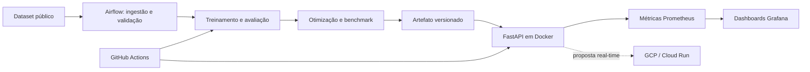

# Tech Challenge - Fase 3 | ML Engineering

Sistema de triagem automática de textos médicos, construído como um classificador NLP leve e servido por uma API REST. O projeto reúne treinamento e otimização do modelo, CI/CD, retreino orquestrado, observabilidade e uma proposta de implantação em nuvem.

> Status: fundação arquitetural concluída. Os componentes funcionais serão entregues incrementalmente pelas branches de cada integrante.

## Equipe e responsabilidades

| Integrante | Responsabilidades principais |
|---|---|
| Fábio Polli | Repositório e arquitetura inicial; CI/CD, Docker e testes; documentação detalhada |
| Denis Melo | EDA e seleção do dataset; DAG funcional do Airflow |
| Will (Bill) | Classificador de texto; otimização de latência; métricas Prometheus/Grafana |
| Romário | API FastAPI; arquitetura em nuvem; vídeo STAR |

As responsabilidades indicam liderança, não trabalho isolado. Mudanças nos contratos entre dados, modelo, API e infraestrutura devem ser revisadas por quem consome o contrato.

## Objetivo e critérios oficiais

O cenário é um hospital que precisa classificar textos médicos por urgência. A solução deve incluir:

- dataset público tabular com uma coluna de texto, uma coluna target e pelo menos 2.000 amostras;
- classificador NLP leve e ao menos uma técnica de otimização de latência;
- API FastAPI em container Docker;
- GitHub Actions com lint e testes;
- DAG Airflow de ingestão, treinamento e persistência do modelo;
- Docker Compose com API, Prometheus e Grafana;
- dashboard com total de requisições, latência e taxa de erro;
- comparação entre a latência do modelo original e do otimizado;
- decisão textual sobre deploy em nuvem;
- vídeo de até cinco minutos no formato STAR.

O acompanhamento detalhado, incluindo pesos e critérios de aceite, está em [`docs/CHECKLIST.md`](docs/CHECKLIST.md).

## Arquitetura planejada



A direção inicial é inferência **real-time**, mantendo batch para ingestão, preparação e retreino. A proposta de GCP (Cloud Run, Artifact Registry e Cloud Storage) é uma hipótese arquitetural a ser validada e detalhada por Romário em um ADR; não representa infraestrutura já implantada.

## Dataset e idioma

Denis avaliará inicialmente:

1. [Medical Abstracts TC Corpus](https://www.kaggle.com/datasets/saharalaa/medical-abstracts-tc-corpus/data?select=medical_tc_train.csv)
2. [MIMIC-III Clinical Database - Open Access](https://www.kaggle.com/datasets/ihssanened/mimic-iii-clinical-databaseopen-access)

Contrato: recorte reproduzível entre 2.000 e 5.000 registros, colunas `text` e `target`,
sem duplicatas exatas ou leakage entre treino e teste. A decisão, a licença e o procedimento
de preparação estão em [docs/dataset.md](docs/dataset.md). Dados brutos, processados e
artefatos binários não devem ser enviados ao Git.

Como os candidatos estão em inglês, a recomendação inicial é manter a inferência sem tradução online. Se entradas em português forem necessárias, a primeira alternativa será tradução offline, versionada e avaliada como parte da preparação dos dados. Isso evita adicionar custo, indisponibilidade, riscos de privacidade e latência ao caminho crítico da API.

## Estrutura do repositório

```text
.
|-- .agents/                 # Workflow colaborativo para agentes
|-- .github/                 # CI e template de pull request
|-- airflow/dags/            # DAGs de treino e retreino
|-- configs/                 # Configurações versionadas
|-- data/{raw,processed}/    # Dados locais, fora do Git
|-- docs/                    # Checklist, workflow, ADRs e documentação
|-- infra/                   # Proposta e código de infraestrutura
|-- models/                  # Artefatos locais, fora do Git
|-- monitoring/              # Prometheus e provisionamento do Grafana
|-- notebooks/               # EDA e experimentos numerados
|-- reports/figures/         # Evidências e figuras versionáveis
|-- scripts/                 # Entradas operacionais reutilizáveis
|-- src/triage_ml/           # Código da aplicação e do pipeline
`-- tests/                   # Testes automatizados
```

Os diretórios reservados contêm arquivos explicativos. Código reutilizável deve sair dos notebooks e entrar em `src/triage_ml`.

## Início rápido da fundação

Pré-requisitos: Python 3.12 e [`uv`](https://docs.astral.sh/uv/).

```bash
uv sync --dev
uv run ruff check .
uv run pytest
```

Os comandos da API, Airflow e stack de observabilidade serão acrescentados quando os respectivos componentes existirem; este README não declara funcionalidades ainda não implementadas.

## Checklist resumido

- [x] Criar repositório e definir arquitetura inicial — Fábio
- [ ] Executar EDA e escolher dataset entre 2.000 e 5.000 registros — Denis
- [ ] Treinar classificador de texto — Bill
- [ ] Construir API FastAPI — Romário
- [~] Configurar CI/CD, Docker e testes — Fábio (CI inicial criado; Docker pendente)
- [ ] Implementar DAG Airflow funcional — Denis
- [ ] Otimizar latência e instrumentar API/Prometheus/Grafana — Bill
- [ ] Documentar arquitetura em nuvem — Romário
- [~] Manter documentação detalhada — Fábio (documento vivo)
- [ ] Gravar vídeo STAR de até cinco minutos — Romário

## Como colaborar com o Codex

Leia [`docs/WORKFLOW_AGENTICO.md`](docs/WORKFLOW_AGENTICO.md). Em resumo, identifique-se, descreva a tarefa e peça ao agente para seguir o `AGENTS.md`. O fluxo obrigatório é `main` atualizada → branch da tarefa → pequenos commits → testes → push → pull request → revisão → merge autorizado.

## Documentação

- [`docs/CHECKLIST.md`](docs/CHECKLIST.md): fonte canônica do progresso e critérios de aceite.
- [`docs/WORKFLOW_AGENTICO.md`](docs/WORKFLOW_AGENTICO.md): guia e casos de uso do Codex.
- [`docs/adr/README.md`](docs/adr/README.md): decisões arquiteturais.
- [`.agents/contracts/README.md`](.agents/contracts/README.md): contratos entre os componentes.

