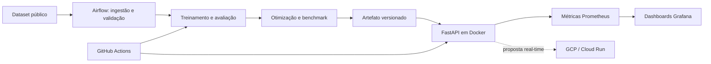

# Tech Challenge — Fase 3 · ML Engineering

> Triagem automática de textos médicos com classificador NLP leve, API FastAPI,
> otimização ONNX, observabilidade Prometheus/Grafana e retreino orquestrado.

Bem-vindo! Este repositório é o resultado de um trabalho em equipe para o Tech
Challenge da Fase 3 do programa de pós-graduação em ML Engineering. Aqui você
encontra tudo o que precisa para entender, rodar e estender a solução: do
dataset e do modelo até a stack de observabilidade e os pipelines de CI/CD.

---

## Índice

- [O que é o projeto](#o-que-é-o-projeto)
- [Quem fez o quê](#quem-fez-o-quê)
- [Status do projeto](#status-do-projeto)
- [Arquitetura em uma olhada](#arquitetura-em-uma-olhada)
- [Dataset e categorias](#dataset-e-categorias)
- [Stack técnica em resumo](#stack-técnica-em-resumo)
- [Como rodar localmente](#como-rodar-localmente)
- [Plataforma em Docker](#plataforma-em-docker)
- [Otimização e observabilidade (Fase 2)](#otimização-e-observabilidade-fase-2)
- [Estrutura do repositório](#estrutura-do-repositório)
- [Documentação complementar](#documentação-complementar)
- [Como contribuir](#como-contribuir)

---

## O que é o projeto

Imagine um hospital que recebe, a cada minuto, abstracts de prontuários,
artigos e relatórios em texto livre. A solução deste projeto classifica
automaticamente esses textos em **cinco categorias clínicas** para acelerar a
triagem, mantendo o profissional de saúde como decisor final.

O entregável combina:

- um **classificador NLP leve** (TF-IDF + LinearSVC) com alternativa ONNX;
- uma **API FastAPI** com autenticação por papel (médico, paciente, serviço);
- uma **DAG Airflow** para retreino versionado e idempotente;
- uma **stack de observabilidade** com Prometheus e Grafana comparando a
  variante `sklearn` e a variante `onnx`;
- **CI/CD** com GitHub Actions, Docker multi-stage endurecido e testes E2E
  via Playwright.

A proposta de implantação em **GCP (Cloud Run)** e o vídeo STAR continuam em
desenvolvimento — acompanhados em [Etapa 8](./docs/reports/Etapa_8_Cloud_video_documentacao.md).

---

## Quem fez o quê

| Integrante    | Responsabilidades                                                                    |
|---------------|--------------------------------------------------------------------------------------|
| **Fábio Polli** | Arquitetura inicial, CI/CD, Docker multi-stage, imagens endurecidas, documentação   |
| **Denis Melo** | EDA e seleção do dataset (Etapa 1), DAG funcional do Airflow (Etapa 7)              |
| **Bill**        | Classificador (Etapa 2), API de desenvolvimento, otimização ONNX (Etapa 5), métricas Prometheus/Grafana (Etapa 6), revisões cruzadas |
| **Romário**     | API FastAPI oficial com RBAC (Etapa 3), arquitetura em nuvem, vídeo STAR            |

Responsabilidades indicam **liderança de frente**, não trabalho isolado.
Mudanças em contratos entre dados, modelo, API e infraestrutura são revisadas
por quem consome o contrato.

---

## Status do projeto

| Etapa | Tema                                                | Responsável | Status                | Relatório                                                                                     |
|------:|-----------------------------------------------------|-------------|-----------------------|-----------------------------------------------------------------------------------------------|
| 1     | Fundação, dados e contratos                         | Denis       | concluída             | [Etapa 1](./docs/reports/Etapa_1_Fundacao_dados_e_contratos.md)                              |
| 2     | Modelo baseline, serialização, API de desenvolvimento | Bill      | concluída             | [Etapa 2](./docs/reports/Etapa_2_Modelo_baseline_e_serialização.md)                          |
| 3     | API FastAPI oficial com RBAC                        | Romário     | concluída             | [Etapa 3](./docs/reports/Etapa_3_API_oficial.md)                                              |
| 4     | CI/CD, Docker multi-stage, Playwright               | Fábio       | concluída (PR #5)     | [Etapa 4](./docs/reports/Etapa_4_CI_CD_Docker.md)                                             |
| 5     | Otimização ONNX (`skl2onnx` opset 17)               | Bill        | concluída             | [Etapa 5](./docs/reports/Etapa_5_Otimizacao_do_modelo.md)                                     |
| 6     | Observabilidade Prometheus/Grafana + privacidade    | Bill        | concluída             | [Etapa 6](./docs/reports/Etapa_6_Observabilidade_Prometheus_Grafana.md)                       |
| 7     | DAG Airflow de retreino com DagsHub                 | Denis       | concluída (idempotente) | [Etapa 7](./docs/reports/Etapa_7_Orquestração_de_retreino.md)                              |
| 8     | Arquitetura em nuvem + vídeo STAR                   | Romário     | em aberto             | [Etapa 8](./docs/reports/Etapa_8_Cloud_video_documentacao.md)                                 |

Aceites oficiais fechados: **100%**. A análise cruzada item-por-item das
Etapas 5 e 6 está em
[Analise_aceites_Etapas_5_e_6.md](./docs/reports/Analise_aceites_Etapas_5_e_6.md).

---

## Arquitetura em uma olhada



A direção inicial é inferência **real-time**, mantendo batch para ingestão,
preparação e retreino. A proposta de GCP é uma hipótese arquitetural a ser
validada em ADR por Romário; **não é infraestrutura já implantada**.

---

## Dataset e categorias

Decisão registrada como [ADR 0001](./docs/adr/0001-escolha-recorte-dataset.md):
**Medical Abstracts TC Corpus** (CC BY-SA 3.0), com cinco categorias clínicas
(`target ∈ {1..5}`). O MIMIC-III foi descartado por exigir treinamento
obrigatório, derivação de labels e maior risco de privacidade.

| `label` | `label_name`                       |
|--------:|------------------------------------|
| 1       | neoplasms                          |
| 2       | digestive system diseases          |
| 3       | nervous system diseases            |
| 4       | cardiovascular diseases            |
| 5       | general pathological conditions    |

**Importante:** o enunciado sugeria um classificador de urgência
(`normal` / `atenção` / `urgente`). Os professores autorizaram o uso das cinco
categorias clínicas acima, registradas em `data/medical_tc_labels.csv`. Veja
[`docs/dataset.md`](./docs/dataset.md) para os detalhes.

**Privacidade primeiro:** como os textos são clínicos, a inferência não usa
tradução online. A `/predict` aplica uma **checagem de idioma local** com
`langid` que rejeita preventivamente qualquer texto fora do allow-list
`{"en"}` antes do modelo ser invocado. Detalhes mais adiante e em
[`docs/guides/GUIA-USO-API.md`](./docs/guides/GUIA-USO-API.md).

---

## Stack técnica em resumo

- **Linguagem e empacotamento:** Python 3.12, [`uv`](https://docs.astral.sh/uv/),
  lockfile `uv.lock`, versões pinadas de NumPy, SciPy, scikit-learn e joblib.
- **Modelo:** `TfidfVectorizer(ngram_range=(1,2), min_df=2, max_df=0.95,
  sublinear_tf=True)` + `LinearSVC(class_weight="balanced")` (selecionado por
  macro-F1 em CV-5 estratificada no treino: `0.7335` vs `0.7319` da
  `LogisticRegression`).
- **Serialização:** diretórios imutáveis `YYYYMMDDTHHMMSSZ-<input_hash>` com
  `model.joblib`, `classes.json`, `metadata.json` (schema validado,
  checksums, versões de dependência, fingerprints).
- **Otimização:** export ONNX via `skl2onnx.convert_sklearn` (opset 17,
  `zipmap=False`), singleton de `InferenceSession`, `__call__` em uma única
  `session.run`.
- **API:** FastAPI com RBAC estático (`doctor` / `patient` / `service`),
  rate limit por IP + fingerprint HMAC-SHA-256 da chave, middleware de
  request-id, headers `X-Request-ID` e `Server-Timing`.
- **Observabilidade:** `prometheus_client` em `CollectorRegistry` privado;
  métricas `triage_ml_requests_total`, `triage_ml_request_latency_seconds`,
  `triage_ml_prediction_errors_total`. Allow-list de labels garante que
  `text`, `label_name` e `request_id` nunca viram label.
- **Orquestração:** Airflow 3.1.7 em Docker com DAG `triage_ml_retraining`
  (idempotente por checksum) e DAG `triage_ml_retraining_optimization`
  (gated por `TRIAGE_OPTIMIZATION_ENABLED`, default `false`).
- **CI/CD:** GitHub Actions com jobs `quality`, `front-e2e` e `container`;
  Playwright Chromium para testes E2E do portal.

---

## Como rodar localmente

### Pré-requisitos

- Python 3.12
- [`uv`](https://docs.astral.sh/uv/) instalado
- (Opcional, para a Fase 2) extras `[observability,optimization]`

### Instalação e sanity check

```bash
uv sync --dev --extra observability --extra optimization
uv run ruff check .
uv run pytest
```

### Treinar um modelo

```bash
uv run triage-ml-train
```

O treino grava uma versão imutável em
`models/YYYYMMDDTHHMMSSZ-<12hex>/` com `model.joblib`, `classes.json`,
`metadata.json` e `summary.json` (schema validado por `schema_version: 1`).
Para trocar de versão sem reiniciar a API de desenvolvimento, use `POST /reload`
ou o picker do dashboard.

### Subir a API de desenvolvimento

A API em [`src/triage_ml/dev_api/`](./src/triage_ml/dev_api) consome o modelo
real — não é um stub. É indicada apenas para validação local. A API oficial de
produção é trabalho do Romário (Etapa 3) e herda o contrato desta.

```bash
# Sem MODEL_PATH: a API escolhe a versão timestampada mais recente em models/
uv run uvicorn triage_ml.dev_api.app:app --host 127.0.0.1 --port 8000

# Ou fixando um artefato específico
export MODEL_PATH=models/20260823T135811Z-bed2194376bc/model.joblib
uv run uvicorn triage_ml.dev_api.app:app --host 127.0.0.1 --port 8000
```

**Endpoints principais:**

| Método | Rota         | Descrição                                                                       |
|--------|--------------|---------------------------------------------------------------------------------|
| GET    | `/health`    | Status do processo, versão carregada e flag `model_loaded`. Falha rápido se o artefato estiver ausente ou inválido. |
| GET    | `/model-info` | Manifesto validado do artefato carregado. Retorna `503` se nada estiver carregado. |
| GET    | `/models`    | Lista versões íntegras no registry (newest-first), sem symlinks nem diretórios incompletos. |
| POST   | `/reload`    | Troca a versão em uso após revalidar manifesto, checksum e classes. Uso exclusivo de desenvolvimento. |
| POST   | `/predict`   | Recebe `{"text": "..."}`, devolve `label`, `label_name`, `score`, `latency_ms`, `request_id`. Erros de validação nunca vazam o `text`. |

Toda resposta de predição traz `X-Request-ID` e
`Server-Timing: detect;dur=<ms>, predict;dur=<ms>`.

**Política de idioma (3 camadas):**

| Camada            | Configuração (`configs/api.yaml`)                  | Erro quando falha                              |
|-------------------|----------------------------------------------------|------------------------------------------------|
| Comprimento mínimo| `api.min_text_chars_for_language_check` (default `20`) | `text_too_short_for_language_check`           |
| Confiança mínima  | `api.min_language_score` (default `0.0`, opt-in)   | `indeterminate_language`                       |
| Allow-list        | `api.supported_languages` (default `["en"]`)       | `unsupported_language`                         |

O detector (`langid`) roda 100% local, sem rede. O corpo do erro carrega
`detected_language` e `detected_language_score` quando disponíveis, mas
**nunca** o `text`.

### Rodar os testes

```bash
uv run pytest                        # testes unitários e de integração
uv run ruff check .                  # lint
uv run ruff format --check .         # verificação de formatação
```

---

## Plataforma em Docker

A stack principal sobe com o `docker-compose.yml` da raiz:

| Serviço        | Porta padrão | Para quê serve                                                |
|----------------|-------------:|---------------------------------------------------------------|
| `api-prod`     | 8000         | API FastAPI oficial e inferência                              |
| `portal-prod`  | 8501         | Front do Romário (login médico/paciente)                      |
| `dashboard-dev`| 8502         | Front técnico do Bill (perfil `dev`, chaves dedicadas)        |

O Airflow fica isolado em [`docker-compose.airflow.yml`](./docker-compose.airflow.yml),
na porta `8080`, para retreino e inferência poderem subir e descer de forma
independente.

### Antes da primeira execução

Copie `.env.example` para `.env` e configure:

```dotenv
API_MODEL_PATH=/models/<versao>/model.joblib
TRIAGE_ML_API_KEY_SERVICE=<chave-com-32-ou-mais-caracteres>
TRIAGE_ML_API_KEY_DOCTOR=<chave-com-32-ou-mais-caracteres>
TRIAGE_ML_API_KEY_PATIENT=<chave-com-32-ou-mais-caracteres>
TRIAGE_ML_DASHBOARD_DOCTOR_USERNAME=medico-demo
TRIAGE_ML_DASHBOARD_DOCTOR_PASSWORD=<senha-local>
TRIAGE_ML_DASHBOARD_PATIENT_USERNAME=paciente-demo
TRIAGE_ML_DASHBOARD_PATIENT_PASSWORD=<outra-senha-local>
```

`API_MODEL_PATH` é o caminho **dentro** do contêiner. `.env` é local e
ignorado pelo Git. A aplicação só lê variáveis com prefixo `TRIAGE_ML_`.

### Subir a stack

```bash
docker compose up --build -d --wait api-prod portal-prod dashboard-dev
docker compose ps
curl http://localhost:8000/health
docker compose logs --tail=100 api-prod portal-prod dashboard-dev
docker compose down
```

Após o healthcheck, a API fica em `http://localhost:8000`, o portal por papel
em `http://localhost:8501` e o dashboard técnico em `http://localhost:8502`.

### Hardening das imagens

- Usuário não-root (`uid=10001`).
- Healthcheck HTTP sem `curl`.
- `/models` montado como **somente leitura**.
- `/tmp` em `tmpfs` limitado.
- `cap_drop: ALL` + `no-new-privileges`.
- Versões pinadas de NumPy, SciPy, scikit-learn e joblib (contrato de
  serialização idêntico em treino e inferência).

### Os dois fronts

| Front                  | Serviço         | Público-alvo                                                |
|------------------------|-----------------|-------------------------------------------------------------|
| `front/app_prod.py`    | `portal-prod`   | Médico e paciente, com login e RBAC                         |
| `front/app_dev.py`     | `dashboard-dev` | Validação técnica: health, modelo, idioma, predição, reload |

No portal, a sessão de paciente percorre uma jornada informativa e **não
recebe classe, score ou diagnóstico automático**. A sessão médica pode enviar
um texto clínico sintético em inglês para apoio à triagem; a decisão final
permanece humana. Cenários completos e credenciais demonstrativas em
[`docs/guides/GUIA-USO-FRONTS.md`](./docs/guides/GUIA-USO-FRONTS.md).

### Quando o `.env` precisa do DagsHub

Para `api-prod`, `portal-prod` e `dashboard-dev` **não** é necessário
preencher `DAGSHUB_USERNAME` ou `DAGSHUB_USER_TOKEN`. O modelo precisa existir
localmente em `models/<versao>/`.

As variáveis do DagsHub só são exigidas ao rodar o Airflow com ingestão remota
via `docker-compose.airflow.yml`. Use um token de leitura, **nunca** a senha
da conta, e mantenha `.env` fora do Git.

---

## Otimização e observabilidade (Fase 2)

A Fase 2 adiciona exportação ONNX, benchmark controlado, comparativo entre a
variante `sklearn` e a variante `onnx`, e uma stack overlay com Prometheus e
Grafana.

### DAG de otimização

[`triage_ml_retraining_optimization`](./airflow/dags/triage_retraining_optimization.py)
reaproveita ingestão, validação e treino da Etapa 7 e itera sobre o catálogo
`dataset_sizing: [5000, 6000, 7000]` definido em
[`configs/training.yaml`](./configs/training.yaml) (sobrescrevível em runtime
via `TRIAGE_DATASET_SLICES`).

Para cada corte, a DAG exporta `model.onnx`, publica checksums e o vínculo
com `model.joblib` em `metadata.json`, recria o split de teste pelo fingerprint
e grava `reports/benchmarks/optimization_<sample_size>.json`. A promoção exige
degradação máxima de macro-F1 de **1 pp** e p95 ONNX **menor** que o baseline.

> A DAG é gated por `TRIAGE_OPTIMIZATION_ENABLED=false` (default) para
> preservar o stack da Etapa 7.

### Variantes na API

A API oficial passou a aceitar `TRIAGE_ML_MODEL_VARIANT={sklearn,onnx}`:

- `sklearn` (default) preserva o deploy atual.
- `onnx` exige que `model.onnx` exista ao lado de `model.joblib`. O adapter
  ONNX implementa `predict`/`predict_proba` e cai para `decision_function`
  quando o classificador é `LinearSVC` (sem superfície probabilística
  calibrada — ver [ADR 0003](./docs/adr/0003-flexibilizar-sample-size.md)).

A escolha é resolvida em `app.state.model_variant` como **single source of
truth** via `lifespan`.

### Stack overlay (`infra/docker-compose.yml`)

Sobe em rede privada:

- `api-sklearn` (porta 8001)
- `api-onnx` (porta 8002)
- `prometheus` (porta 9090)
- `grafana` (porta 3000)

O dashboard Grafana (provisionado em
[`monitoring/grafana/dashboards/triage_ml.json`](./monitoring/grafana/dashboards/triage_ml.json))
compara latência, taxa de erro e throughput por `model_variant`. As versões
físicas do dashboard ficam em
`reports/figures/triage_ml_dashboard.{json,png}` (geradas por
[`scripts/render_observability_dashboard.py`](./scripts/render_observability_dashboard.py)).

```bash
# Helper escreve .env com MODEL_VERSION detectado de models/ e secrets aleatórios
uv run python scripts/bootstrap_observability_overlay.py

docker compose -f infra/docker-compose.yml up -d --wait
docker compose -f infra/docker-compose.yml ps

uv run python scripts/generate_observability_traffic.py \
  --sklearn-url http://127.0.0.1:8001 --onnx-url http://127.0.0.1:8002 \
  --api-key "$(grep '^TRIAGE_ML_API_KEY_DOCTOR=' .env | cut -d= -f2)"

# Acompanhe no Grafana (http://127.0.0.1:3000) e no Prometheus (http://127.0.0.1:9090)
docker compose -f infra/docker-compose.yml down
```

### Política de privacidade da observabilidade

- `text` é classificado e **descartado** — nunca persistido, nunca copiado para
  log, nunca copiado para label de métrica, nunca retornado em erro.
- Labels Prometheus permitidas: `route`, `method`, `status`, `model_variant`,
  `error_code` (+ `le` reservado para buckets de histograma).
- Cobertura automatizada em
  [`tests/test_observability_privacy.py`](./tests/test_observability_privacy.py).

### Métricas expostas

- `triage_ml_requests_total{route, method, status, model_variant}`
- `triage_ml_request_latency_seconds{...}` (histograma, buckets 0.005..2.5 s)
- `triage_ml_prediction_errors_total{route, error_code, model_variant}` (allow-list público)

Painéis do dashboard: `Requests by route/status`, `Latency p95` por
`model_variant`, `Prediction error rate`, `Baseline vs optimized (p95)` (tabela
p50/p95/p99).

---

## Estrutura do repositório

```
.
|-- .agents/                 # Workflow colaborativo para agentes (Codex)
|-- .github/                 # CI e template de pull request
|-- airflow/                 # DAGs e entrypoint do retraining
|-- configs/                 # Configurações versionadas (api, training)
|-- data/{raw,processed}/    # Dados locais (fora do Git)
|-- docs/                    # Checklist, ADRs, guides, plans, reports
|-- front/                   # Portal do Romário + dashboard técnico do Bill
|-- infra/                   # Compose overlay de otimização + observabilidade
|-- models/                  # Artefatos locais (fora do Git)
|-- monitoring/              # Prometheus + provisionamento do Grafana
|-- notebooks/               # EDA e experimentos numerados
|-- reports/{figures,benchmarks,evidence}/  # Evidências versionáveis
|-- scripts/                 # Entradas operacionais (treino, benchmark, overlay, dashboard)
|-- src/triage_ml/           # Código da aplicação (api, dev_api, models, optimization, observability, orchestration)
|-- tests/                   # Testes unitários, integração e E2E (Playwright)
|-- docker-compose.yml       # Stack principal (api, portal, dashboard)
|-- docker-compose.airflow.yml  # Airflow isolado
|-- Dockerfile               # Imagens multi-stage endurecidas
`-- pyproject.toml + uv.lock # Dependências pinadas
```

> Os diretórios reservados contêm arquivos explicativos. Código reutilizável
> deve sair dos notebooks e entrar em `src/triage_ml`.

---

## Documentação complementar

| Onde olhar                                                          | Para quê                                                              |
|--------------------------------------------------------------------|-----------------------------------------------------------------------|
| [`docs/CHECKLIST.md`](./docs/CHECKLIST.md)                          | Fonte canônica do progresso e critérios de aceite                     |
| [`docs/plans/PLAN-text-classifier.md`](./docs/plans/PLAN-text-classifier.md) | Plano de implementação (Fases 1 e 2)                          |
| [`docs/adr/`](./docs/adr)                                          | Decisões arquiteturais (0001 dataset, 0002 RBAC, 0003 sample-size)    |
| [`.agents/contracts/`](./.agents/contracts)                        | Contratos entre os componentes do projeto                             |
| [`docs/guides/GUIA-USO-API.md`](./docs/guides/GUIA-USO-API.md)     | Uso detalhado da API oficial e da API de desenvolvimento              |
| [`docs/guides/GUIA-TREINAMENTO.md`](./docs/guides/GUIA-TREINAMENTO.md) | Ciclo completo de treinamento                                     |
| [`docs/guides/GUIA-PROMETHEUS-GRAFANA.md`](./docs/guides/GUIA-PROMETHEUS-GRAFANA.md) | Stack de observabilidade e troubleshooting             |
| [`docs/guides/GUIA-USO-FRONTS.md`](./docs/guides/GUIA-USO-FRONTS.md) | Cenários completos do portal e dashboard técnico                     |
| [`docs/reports/`](./docs/reports)                                  | Relatórios individuais por etapa (1-7) + análise dos aceites 5+6     |

---

## Como contribuir

1. Leia [`AGENTS.md`](./AGENTS.md) e [`CONTRIBUTING.md`](./CONTRIBUTING.md).
2. Trabalhe em uma branch a partir de `main` atualizada.
3. Faça commits pequenos e descritivos.
4. Rode `uv run ruff check .` e `uv run pytest` antes de pedir review.
5. Abra Pull Request usando o template em
   [`.github/pull_request_template.md`](./.github/pull_request_template.md).

Para colaborações assistidas por Codex, siga o fluxo descrito em
[`docs/WORKFLOW_AGENTICO.md`](./docs/WORKFLOW_AGENTICO.md).

---

> Dúvidas, sugestões ou bugs? Abra uma issue no GitHub. Bom trabalho!