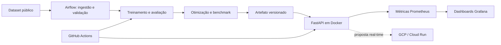

# Tech Challenge - Fase 3 | ML Engineering

Sistema de triagem automática de textos médicos, construído como um classificador NLP leve e servido por uma API REST. O projeto reúne treinamento e otimização do modelo, CI/CD, retreino orquestrado, observabilidade e uma proposta de implantação em nuvem.

> Status: fundação, modelo baseline, API oficial, Airflow e Etapa 4 de CI/CD concluídos.
> API, portal por papel e dashboard técnico foram validados em Docker local e no GitHub
> Actions. Otimização, observabilidade e arquitetura em nuvem continuam em desenvolvimento.

## Equipe e responsabilidades

| Integrante | Responsabilidades principais |
|---|---|
| Fábio Polli | Repositório e arquitetura inicial; CI/CD, Docker e testes; documentação detalhada |
| Denis Melo | EDA e seleção do dataset; DAG funcional do Airflow |
| Will (Bill) | Classificador de texto; otimização de latência; métricas Prometheus/Grafana |
| Romário | API FastAPI; arquitetura em nuvem; vídeo STAR |

As responsabilidades indicam liderança, não trabalho isolado. Mudanças nos contratos entre dados, modelo, API e infraestrutura devem ser revisadas por quem consome o contrato.

## Objetivo e critérios oficiais

O cenário é um hospital que precisa classificar textos médicos por urgência. A solução deve incluir:

- dataset público tabular com uma coluna de texto, uma coluna target e pelo menos 2.000 amostras;
- classificador NLP leve e ao menos uma técnica de otimização de latência;
- API FastAPI em container Docker;
- GitHub Actions com lint e testes;
- DAG Airflow de ingestão, treinamento e persistência do modelo;
- Docker Compose com API, Prometheus e Grafana;
- dashboard com total de requisições, latência e taxa de erro;
- comparação entre a latência do modelo original e do otimizado;
- decisão textual sobre deploy em nuvem;
- vídeo de até cinco minutos no formato STAR.

O acompanhamento detalhado, incluindo pesos e critérios de aceite, está em [`docs/CHECKLIST.md`](docs/CHECKLIST.md).

## Arquitetura planejada



A direção inicial é inferência **real-time**, mantendo batch para ingestão, preparação e retreino. A proposta de GCP (Cloud Run, Artifact Registry e Cloud Storage) é uma hipótese arquitetural a ser validada e detalhada por Romário em um ADR; não representa infraestrutura já implantada.

## Dataset e idioma

Denis avaliará inicialmente:

1. [Medical Abstracts TC Corpus](https://www.kaggle.com/datasets/saharalaa/medical-abstracts-tc-corpus/data?select=medical_tc_train.csv)
2. [MIMIC-III Clinical Database - Open Access](https://www.kaggle.com/datasets/ihssanened/mimic-iii-clinical-databaseopen-access)

Contrato: recorte reproduzível entre 2.000 e 5.000 registros, colunas `text` e `target`,
sem duplicatas exatas ou leakage entre treino e teste. A decisão, a licença e o procedimento
de preparação estão em [docs/dataset.md](docs/dataset.md). Dados brutos, processados e
artefatos binários não devem ser enviados ao Git.

Como os candidatos estão em inglês, a recomendação inicial é manter a inferência sem tradução online. Para não correr riscos de LGPD ou de latência em dados clínicos sensíveis, a API ganhou uma **checagem de idioma local** com `langid` que rejeita preventivamente qualquer texto fora do allow-list `{"en"}` antes do modelo ser invocado. Mais detalhes na seção "Modelo (Bill)".

## Estrutura do repositório

```text
.
|-- .agents/                 # Workflow colaborativo para agentes
|-- .github/                 # CI e template de pull request
|-- airflow/dags/            # DAGs de treino e retreino
|-- configs/                 # Configurações versionadas
|-- data/{raw,processed}/    # Dados locais, fora do Git
|-- docs/                    # Checklist, workflow, ADRs e documentação
|-- infra/                   # Proposta e código de infraestrutura
|-- models/                  # Artefatos locais, fora do Git
|-- monitoring/              # Prometheus e provisionamento do Grafana
|-- notebooks/               # EDA e experimentos numerados
|-- reports/figures/         # Evidências e figuras versionáveis
|-- scripts/                 # Entradas operacionais reutilizáveis
|-- src/triage_ml/           # Código da aplicação e do pipeline
`-- tests/                   # Testes automatizados
```

Os diretórios reservados contêm arquivos explicativos. Código reutilizável deve sair dos notebooks e entrar em `src/triage_ml`.

## Início rápido

Pré-requisitos: Python 3.12 e [`uv`](https://docs.astral.sh/uv/).

```bash
uv sync --dev
uv run ruff check .
uv run pytest
```

Para executar a plataforma, consulte [Plataforma local em Docker](#plataforma-local-em-docker).
O Airflow possui instruções próprias em [`airflow/dags/README.md`](airflow/dags/README.md).
Prometheus e Grafana permanecem planejados e serão adicionados sem alterar o contrato da API.

## Checklist resumido

- [x] Criar repositório e definir arquitetura inicial — Fábio
- [x] Executar EDA e escolher dataset entre 2.000 e 5.000 registros — Denis
- [x] Treinar classificador de texto (baseline TF-IDF + classificador linear) — Bill
- [x] Construir API FastAPI — Romário; imagem Docker da API oficial validada por Fábio
- [x] Configurar CI/CD, Docker e testes — Fábio (API e dois fronts validados localmente;
  workflow remoto verde no PR #5)
- [x] Implementar DAG Airflow funcional — Denis (execução completa e idempotência
  validadas em Docker contra o DagsHub)
- [ ] Otimizar latência e instrumentar API/Prometheus/Grafana — Bill
- [ ] Documentar arquitetura em nuvem — Romário
- [~] Manter documentação detalhada — Fábio (documento vivo)
- [ ] Gravar vídeo STAR de até cinco minutos — Romário

## Modelo (Bill)

Esta seção documenta a entrega do classificador NLP leve do projeto.

### O que o modelo faz

O classificador recebe um texto livre (abstract médico) e devolve uma das cinco categorias clínicas do **Medical Abstracts TC Corpus**:

| `label` | `label_name` |
|---|---|
| 1 | neoplasms |
| 2 | digestive system diseases |
| 3 | nervous system diseases |
| 4 | cardiovascular diseases |
| 5 | general pathological conditions |

> **Nota sobre o descompasso com o enunciado.** O enunciado do Tech Challenge sugere um classificador de urgência (`normal` / `atenção` / `urgente`). Os professores autorizaram o uso das cinco categorias clínicas acima neste projeto, registradas em `data/medical_tc_labels.csv`. Isso está documentado em `docs/dataset.md` e em `docs/CHECKLIST.md`.

### Stack e justificativa

- **Vetorizador**: `TfidfVectorizer(ngram_range=(1,2), min_df=2, max_df=0.95, sublinear_tf=True)`. Sugestão do enunciado; leve, determinístico, sem dependência externa.
- **Seleção do baseline**: `LogisticRegression` e `LinearSVC`, ambos com `class_weight="balanced"`, são comparados por macro-F1 em validação cruzada estratificada somente no treino. O `LinearSVC` foi selecionado (`0.7335` contra `0.7319`) antes da avaliação final no teste.
- **Score**: `LinearSVC` não expõe `predict_proba`; por isso a API retorna `score=null` para o artefato selecionado. Um override explícito de Logistic Regression continua disponível para experimentos.
- **Por que não Random Forest?** O enunciado cita TF-IDF + Random Forest como exemplo. Em TF-IDF, RF explode o custo de inferência (centenas de árvores) sem ganho consistente de F1 sobre modelos lineares em texto. Optamos por um classificador linear, mais alinhado ao requisito de "modelo leve" e à operação real-time da API.
- **Serialização**: diretórios imutáveis `YYYYMMDDTHHMMSSZ-<input_hash>` com `model.joblib`, `classes.json` e `metadata.json`, publicados por staging + `rename` atômico. O manifesto registra schema, classes e nomes, seleção, versões, commit Git, fingerprints e checksum. O loader valida manifesto/checksum antes do `joblib` e confere estrutura, parâmetros declarados e classes depois da carga.
- **Seeds**: 42 em todos os pontos estocásticos.

### Métricas atuais (recorte preparado, 5.000 amostras, split 80/20)

```
n_train=4000 n_test=1000
accuracy=0.7460
balanced_accuracy=0.7221
macro_f1=0.7296
weighted_f1=0.7438
```

Figuras existentes em `reports/figures/` e novas execuções versionadas em
`reports/figures/<model_version>/`:

- `08_confusion_matrix_linear_svc.png` — matriz de confusão do modelo selecionado no split de teste.
- `08_top_features_linear_svc.png` — top-12 coeficientes por classe.

### Como treinar

```bash
# Compara LR/LinearSVC no treino, seleciona o melhor e cria uma versão imutável
uv run triage-ml-train

# Override explícito para reproduzir um candidato específico
uv run triage-ml-train \
  --classifier logreg
```

O treino grava em `models/YYYYMMDDTHHMMSSZ-<12hex>/` os arquivos `model.joblib`,
`classes.json`, `metadata.json` e `summary.json` (validado por `schema_version: 1`).
Cada versão é imutável: para trocar de versão sem reiniciar a API de desenvolvimento,
use `POST /reload` ou o picker do dashboard.

Hiperparâmetros editáveis em `configs/training.yaml`.

### Como rodar a API de desenvolvimento

A API de desenvolvimento fica em [`src/triage_ml/dev_api/`](src/triage_ml/dev_api/) e **consome o modelo real treinado** (`models/<versão>/model.joblib`). Não é um stub. O nome `dev_api` deixa explícito que é uma API de validação local — a API oficial de produção é trabalho do Romário (Etapa 3 do checklist) e herdará o contrato desta.

Execute-a vinculada a localhost e com um único worker. O endpoint administrativo `/reload` não possui autenticação e altera estado apenas no processo que recebeu a chamada; ele não é apropriado para exposição em rede nem execução multiworker.

```bash
# Sem MODEL_PATH: a API escolhe automaticamente a versão timestampada mais recente em models/
uv run uvicorn triage_ml.dev_api.app:app --host 127.0.0.1 --port 8000

# Ou fixando um artefato específico
export MODEL_PATH=models/20260823T135811Z-bed2194376bc/model.joblib
uv run uvicorn triage_ml.dev_api.app:app --host 127.0.0.1 --port 8000
```

Endpoints:

- `GET /health` → `{"status": "ok|degraded", "model_version": "...", "model_loaded": true|false}`. Se o artefato estiver ausente ou inválido, a aplicação **não sobe** (RuntimeError no startup).
- `GET /model-info` → manifesto validado do artefato (`model_version`, `model_name`, `task_type`, `language`, `classes`, `label_mapping`, `random_state`, `n_train`, `n_test`, `metrics`, `preprocessing`, `selection`, `dependency_versions`, `git_commit`, `git_dirty`, `created_at`). Retorna `503 model_not_ready` se o artefato não estiver carregado. Permite que ferramentas externas inspecionem o que está em inferência sem tocar o filesystem.
- `GET /models` → lista somente versões completas e íntegras no mesmo registry do holder (newest-first) + a versão atualmente em uso. Diretórios incompletos e symlinks são omitidos.
- `POST /reload` → corpo `{"model_version": "YYYYMMDDTHHMMSSZ-<12hex>"}`. Troca o holder global do processo após re-validar manifesto, checksum, estrutura e classes. A publicação ocorre sob lock e cada predição usa um snapshot consistente. Retorna `404 model_not_found` ou `500 model_incompatible`; o modelo anterior permanece em uso.
- `POST /predict` → corpo `{"text": "..."}`. Resposta inclui `label`, `label_name`, `score`, `model_version`, `latency_ms`, `request_id` e `warnings`. Erros de validação retornam `ErrorOut(request_id, error_code, message, detected_language?, detected_language_score?)` com HTTP 422 e nunca vazam o texto clínico.
- Toda resposta de predição traz `X-Request-ID` (gerado internamente) e `Server-Timing: detect;dur=<ms>, predict;dur=<ms>` (ou apenas `detect;dur=<ms>` quando a checagem de idioma interrompe o fluxo), prontos para a Etapa 6 (Prometheus/Grafana).

Variável de ambiente: `MODEL_PATH`, apontando para o `model.joblib` versionado. Sem ela, a API dev local usa o artefato timestampado mais recente em `models/`; a aplicação falha rapidamente se o artefato estiver ausente ou incompatível. Os nomes das classes vêm somente do `metadata.json`.

#### Política de idioma (`langid` local)

Antes de chamar o pipeline, a `/predict` aplica uma política de idioma em três camadas configuradas por `configs/api.yaml`:

| Camada | Configuração | Comportamento quando falha |
|---|---|---|
| Comprimento mínimo | `api.min_text_chars_for_language_check` (default `20`) | `error_code=text_too_short_for_language_check` |
| Confiança mínima | `api.min_language_score` (default `0.0`, opt-in) | `error_code=indeterminate_language` |
| Allow-list de idiomas | `api.supported_languages` (default `["en"]`) | `error_code=unsupported_language` |

O detector é `langid`, roda 100% local, sem rede, e usa `LanguageIdentifier(norm_probs=True)`. O valor retornado está em `[0, 1]`, mas não é uma confiança calibrada; qualquer limiar positivo deve ser validado em entradas representativas. A configuração é validada no startup e sua allow-list deve coincidir com o idioma do manifesto. O corpo do erro carrega `detected_language` e `detected_language_score` quando disponíveis, mas **nunca** o `text`.

A API oficial (Docker, auth, métricas Prometheus) é trabalho do Romário (Etapa 3 do checklist); este esqueleto já expõe `latency_ms`, `request_id`, `X-Request-ID` e `Server-Timing` para acelerar a integração.

### Como rodar o dashboard de desenvolvimento

Para testar a API manualmente sem `curl` na mão, há um dashboard Streamlit em [`front/app_dev.py`](front/app_dev.py). Ele fala HTTP contra qualquer instância da API (URL configurável na sidebar; default `http://127.0.0.1:8000`). Tem três abas e uma sidebar fixa:

**Abas:**

- **Health** — chama `GET /health` e mostra `status`, `model_version`, `model_loaded`.
- **Predição** — área de texto + `POST /predict` exibindo `label`, `label_name`, `score`, `latency_ms`, `request_id` e os headers `X-Request-ID` / `Server-Timing`.
- **Política de idioma** — três cenários reproduzíveis via HTTP (texto curto, idioma fora do allow-list e inglês válido). Probabilidade baixa é coberta nos testes e no script com detector mockado.

**Sidebar:**

- **Conexão** — URL base da API + botão "Atualizar health".
- **🔁 Trocar modelo** — consome `GET /models` para listar versões válidas, mostra a versão em uso e dispara `POST /reload`. O picker fica na sessão Streamlit; o reload altera globalmente o processo da API e deve ser usado apenas no ambiente local de desenvolvimento.
- **🧠 Modelo** — consome `GET /model-info` e exibe, em expanders, a identidade do artefato carregado (`model_version`, `model_name`, `task_type`, `language`), dados de treinamento (`n_train`, `n_test`, `random_state`, `git_commit`, `created_at`, `dependency_versions`), a seleção do classificador (candidatos `logreg` × `linear_svc` com `mean_macro_f1 ± std`) e as métricas (`accuracy`, `balanced_accuracy`, `macro_f1`, `weighted_f1` globais + tabela per-classe com precision/recall/F1/support).

```bash
# 1. Suba a API em outro terminal
uv run uvicorn triage_ml.dev_api.app:app --host 127.0.0.1 --port 8000

# 2. Abra o dashboard
uv run streamlit run front/app_dev.py
```

O dashboard **não** persiste payloads nem textos em disco; valores dos widgets permanecem em memória durante a sessão. Latência, taxa de erro e volume continuam no stack **Prometheus + Grafana** (`monitoring/`). Mais detalhes em [`front/README.md`](front/README.md).

### Como rodar os testes

```bash
uv run pytest             # baseline, artefato, treino, API, idioma e dashboard
uv run ruff check .       # lint
uv run ruff format --check .  # verificação de formatação
```

## Plataforma local em Docker

Pré-requisitos: Docker Desktop em execução, um artefato válido sob `models/<versao>/`
e um arquivo `.env` local. A stack principal possui:

| Serviço | Porta padrão | Finalidade |
|---|---:|---|
| `api-prod` | 8000 | API FastAPI e inferência com o modelo real |
| `portal-prod` | 8501 | front do Romário, com login médico/paciente |
| `dashboard-dev` | 8502 | front técnico do Bill, com health, modelo e testes manuais |

O Airflow permanece isolado em `docker-compose.airflow.yml`, na porta 8080, para que
retreino e inferência possam ser iniciados ou encerrados independentemente.

A imagem na raiz executa `triage_ml.api.app:app` com um worker, usuário não-root e
healthcheck nativo. O modelo não entra na imagem: `models/` é montado somente para leitura.
O Compose também remove capabilities Linux, bloqueia ganho de privilégios e deixa o
filesystem do contêiner somente para leitura, com um `tmpfs` limitado em `/tmp`.

Antes da primeira execução, copie `.env.example` para `.env` e configure:

```dotenv
API_MODEL_PATH=/models/<versao>/model.joblib
TRIAGE_ML_API_KEY_SERVICE=<chave-com-32-ou-mais-caracteres>
TRIAGE_ML_API_KEY_DOCTOR=<chave-com-32-ou-mais-caracteres>
TRIAGE_ML_API_KEY_PATIENT=<chave-com-32-ou-mais-caracteres>
TRIAGE_ML_DASHBOARD_DOCTOR_USERNAME=medico-demo
TRIAGE_ML_DASHBOARD_DOCTOR_PASSWORD=<senha-local>
TRIAGE_ML_DASHBOARD_PATIENT_USERNAME=paciente-demo
TRIAGE_ML_DASHBOARD_PATIENT_PASSWORD=<outra-senha-local>
```

`API_MODEL_PATH` usa o caminho **interno** do contêiner. As chaves do exemplo devem ser
substituídas; `.env` é local e ignorado pelo Git. A aplicação lê somente variáveis de
processo com prefixo `TRIAGE_ML_`; o Compose é responsável por selecionar o que sai do
arquivo compartilhado `.env` e entra no serviço.

```bash
docker compose up --build -d --wait api-prod portal-prod dashboard-dev
docker compose ps
curl http://localhost:8000/health
docker compose logs --tail=100 api-prod portal-prod dashboard-dev
docker compose down
```

Após o healthcheck, acesse a API em `http://localhost:8000`, o portal por papel em
`http://localhost:8501` e o dashboard técnico em `http://localhost:8502`. Os três serviços
usam a rede interna do Compose; somente os processos Streamlit recebem as chaves necessárias
às suas funções, sempre no servidor e nunca incorporadas às imagens.

O serviço falha rapidamente se faltar uma chave, se o modelo não existir ou se as versões
de NumPy, SciPy e scikit-learn forem incompatíveis com o manifesto do artefato. Essas
dependências ficam fixadas no `pyproject.toml` e no `uv.lock` para treino e inferência
usarem o mesmo contrato de serialização.

No GitHub Actions, o job `quality` verifica lockfile, formato, lint, testes e pacote. Após
ele passar, `front-e2e` valida o portal no Chromium e `container` constrói os targets da
API, portal e dashboard, importa a aplicação ASGI e audita usuário e metadados das imagens.
Modelos e segredos não são necessários nem incluídos nesse build. A execução remota nº 39
foi concluída com sucesso no [PR #5](https://github.com/fabiopolli/pos-ml-eng-tech-challenge-fase-03/pull/5).

Para os casos de uso do médico, paciente e dashboard técnico, consulte o
[`Guia de uso dos fronts`](docs/guides/GUIA-USO-FRONTS.md). A validação detalhada das
imagens está em [`Etapa 4 — CI/CD, Docker e testes`](docs/reports/Etapa_4_CI_CD_Docker.md).

## Plano de implementação

O detalhamento completo (Fase 1 e Fase 2) está em [`docs/plans/PLAN-text-classifier.md`](docs/plans/PLAN-text-classifier.md). A Fase 2 — otimização ONNX, Prometheus, Grafana e dashboard — ainda não foi executada.

## Como colaborar com o Codex

Leia [`docs/WORKFLOW_AGENTICO.md`](docs/WORKFLOW_AGENTICO.md). Em resumo, identifique-se, descreva a tarefa e peça ao agente para seguir o `AGENTS.md`. O fluxo obrigatório é `main` atualizada → branch da tarefa → pequenos commits → testes → push → pull request → revisão → merge autorizado.

## Documentação

- [`docs/CHECKLIST.md`](docs/CHECKLIST.md): fonte canônica do progresso e critérios de aceite.
- [`docs/WORKFLOW_AGENTICO.md`](docs/WORKFLOW_AGENTICO.md): guia e casos de uso do Codex.
- [`docs/adr/README.md`](docs/adr/README.md): decisões arquiteturais.
- [`.agents/contracts/README.md`](.agents/contracts/README.md): contratos entre os componentes.
