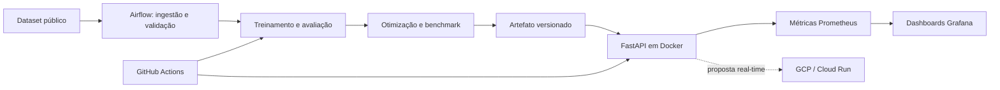

# Tech Challenge - Fase 3 | ML Engineering

Sistema de triagem automática de textos médicos, construído como um classificador NLP leve e servido por uma API REST. O projeto reúne treinamento e otimização do modelo, CI/CD, retreino orquestrado, observabilidade e uma proposta de implantação em nuvem.

> **Status:** Etapas 1-7 concluídas. Otimização ONNX e observabilidade (Prometheus + Grafana) entregues (Fase 2 — Etapas 5 e 6). Arquitetura em nuvem (Etapa 8) e vídeo STAR continuam em desenvolvimento por Romário.

## Equipe e responsabilidades

| Integrante | Responsabilidades principais |
|---|---|
| Fábio Polli | Repositório e arquitetura inicial; CI/CD (`infra/`, `.github/`, `Dockerfile`), Docker e testes; documentação detalhada |
| Denis Melo | EDA e seleção do dataset (Etapa 1); DAG funcional do Airflow (Etapa 7) |
| Bill | Classificador de texto (Etapa 2); API de desenvolvimento; otimização ONNX (Etapa 5); métricas Prometheus/Grafana (Etapa 6); revisões cruzadas de todas as Etapas 1-7 |
| Romário | API FastAPI oficial (Etapa 3); arquitetura em nuvem; vídeo STAR |

As responsabilidades indicam liderança, não trabalho isolado. Mudanças nos contratos entre dados, modelo, API e infraestrutura devem ser revisadas por quem consome o contrato.

## Status consolidado por etapa

| Etapa | Tema | Responsável | Período | Status | Relatório |
|---:|---|---|---|---|---|
| 1 | Fundação, dados e contratos (dataset, EDA, schema) | Denis | 2026-08-23 a 2026-09-07 | ✅ concluída | [Etapa_1](./docs/reports/Etapa_1_Fundacao_dados_e_contratos.md) |
| 2 | Modelo baseline + serialização + API de desenvolvimento | Bill | 2026-08-23 a 2026-09-07 | ✅ concluída | [Etapa_2](./docs/reports/Etapa_2_Modelo_baseline_e_serialização.md) |
| 3 | API FastAPI oficial com RBAC | Romário | 2026-08-30 a 2026-09-07 | ✅ concluída | [Etapa_3](./docs/reports/Etapa_3_API_oficial.md) |
| 4 | CI/CD, Docker multi-stage e Playwright | Fábio | 2026-09-05 a 2026-09-07 | ✅ concluída (PR #5 verde) | [Etapa_4](./docs/reports/Etapa_4_CI_CD_Docker.md) |
| 5 | Otimização ONNX + DAG de retraining (`skl2onnx` opset 17) | Bill | 2026-09-07 a 2026-09-08 | ✅ concluída | [Etapa_5](./docs/reports/Etapa_5_Otimizacao_do_modelo.md) |
| 6 | Observabilidade Prometheus/Grafana + política de privacidade | Bill | 2026-09-08 | ✅ concluída | [Etapa_6](./docs/reports/Etapa_6_Observabilidade_Prometheus_Grafana.md) |
| 7 | DAG Airflow de retraining com DagsHub | Denis | 2026-09-04 a 2026-09-07 | ✅ concluída (idempotência validada) | [Etapa_7](./docs/reports/Etapa_7_Orquestração_de_retreino.md) |
| 8 | Arquitetura em nuvem + vídeo STAR | Romário | pendente | ⏳ em aberto | (a publicar) |

Aceite oficial (20% oficial = Etapa 2 + Etapa 5; 15% oficial = Etapa 4 + Etapa 7): **100% fechado**. Análise cruzada item-por-item dos aceites das Etapas 5 e 6 em [Analise_aceites_Etapas_5_e_6.md](./docs/reports/Analise_aceites_Etapas_5_e_6.md).

### Revisão cruzada aplicada em 2026-09-07/08

Após a implementação inicial, Bill executou **dois ciclos** de revisão estática cruzada com cross-validação por dois sub-agentes em todas as Etapas 1-7. Cada relatório individual de etapa traz a lista consolidada das correções aplicadas; o resumo de alto nível:

- **Etapa 1**: `df.head(3)` removido do notebook EDA (vazava 3 abstracts); ADR 0001 criado; contrato de dados explicitado em `.agents/contracts/README.md`.
- **Etapa 2**: leitura direta de `metrics` no dashboard; `load_artifact` detecta parâmetros declarados ausentes; `language_config_incompatible` adicionado ao allow-list; `std_macro_f1` validado com limite superior; re-exports estáveis em `triage_ml.models`.
- **Etapa 3**: `format_exc_info` em structlog; allow-list de `error_code`; `validation_failed` padronizado; `_request_id_for` retorna `None` em vez de `"unknown"`; `predict_latency_ms` separado de `detect`; HMAC-SHA-256 para fingerprint de API key; `RequireRole.allowed_roles` agora `frozenset`.
- **Etapa 4**: `dashboard-dev` desacoplado em `profiles: [dev]` com chaves dedicadas; `hmac.compare_digest` em `fake_api.py`; `trap cleanup EXIT` no job `front-e2e`; readiness loop corrigido.
- **Etapa 5**: `OnnxModelAdapter.__call__` emite 1 `session.run` (antes eram 2); `ModelHolder._onnx_predictor = None` dentro de `self._lock`; `_load_onnx` defensivo contra classes ausentes; `_slice_identity_fields` exige `selected_classifier` explícito; `export_onnx_for_version` com `reused=True` por checksum; `validate_variant_metadata` ruidoso em vez de silencioso.
- **Etapa 6**: `_METRIC_ERROR_CODES` derivado de `ALLOWED_ERROR_CODES | LANGUAGE_ERROR_CODES | {"request_failed"}` (`internal_error` deliberadamente fora — não vaza como label Prometheus).
- **Etapa 7**: `_git_environment()` substitui `os.environ.copy()` (evita herdar segredos do worker para o subprocess do git); `_run_git` sanitiza credenciais via regex; `validate_dataset_file` lê `sample_size`/`random_state` do YAML e limita 200 MiB; `_ensure_no_symlink_ancestor` recusa publicação via symlink; `_atomic_write_json` (tempfile + `os.replace`).

## Objetivo e critérios oficiais

O cenário é um hospital que precisa classificar textos médicos por urgência. A solução inclui:

- dataset público tabular com uma coluna de texto, uma coluna target e pelo menos 2.000 amostras;
- classificador NLP leve e ao menos uma técnica de otimização de latência;
- API FastAPI em container Docker;
- GitHub Actions com lint e testes;
- DAG Airflow de ingestão, treinamento e persistência do modelo;
- Docker Compose com API, Prometheus e Grafana;
- dashboard com total de requisições, latência e taxa de erro;
- comparação entre a latência do modelo original e do otimizado;
- decisão textual sobre deploy em nuvem;
- vídeo de até cinco minutos no formato STAR.

O acompanhamento detalhado, incluindo pesos e critérios de aceite, está em [`docs/CHECKLIST.md`](docs/CHECKLIST.md).

## Arquitetura planejada



A direção inicial é inferência **real-time**, mantendo batch para ingestão, preparação e retreino. A proposta de GCP (Cloud Run, Artifact Registry e Cloud Storage) é uma hipótese arquitetural a ser validada e detalhada por Romário em um ADR; não representa infraestrutura já implantada.

## Dataset e idioma

Denis avaliou inicialmente:

1. [Medical Abstracts TC Corpus](https://www.kaggle.com/datasets/saharalaa/medical-abstracts-tc-corpus/data?select=medical_tc_train.csv)
2. [MIMIC-III Clinical Database - Open Access](https://www.kaggle.com/datasets/ihssanened/mimic-iii-clinical-databaseopen-access)

Decisão registrada como ADR 0001: **Medical Abstracts TC Corpus** (CC BY-SA 3.0), com cinco categorias clínicas (`target ∈ {1..5}`). MIMIC-III foi descartado por exigir treinamento obrigatório, derivação de labels e ter maior risco de privacidade. Detalhes completos em [`docs/adr/0001-escolha-recorte-dataset.md`](docs/adr/0001-escolha-recorte-dataset.md) e em [`docs/dataset.md`](docs/dataset.md).

Contrato: recorte reproduzível entre 2.000 e 5.000 registros (com `dataset_sizing: [5000, 10000, 14000]` no `configs/training.yaml` para a Etapa 5/6 da Fase 2 — vide ADR 0003), colunas `text` e `target`, sem duplicatas exatas ou leakage entre treino e teste. Dados brutos, processados e artefatos binários não devem ser enviados ao Git.

Como os candidatos estão em inglês, a recomendação inicial é manter a inferência sem tradução online. Para não correr riscos de LGPD ou de latência em dados clínicos sensíveis, a API ganhou uma **checagem de idioma local** com `langid` que rejeita preventivamente qualquer texto fora do allow-list `{"en"}` antes do modelo ser invocado. Mais detalhes na seção "Modelo (Bill)".

## Estrutura do repositório

```text
.
|-- .agents/                 # Workflow colaborativo para agentes
|-- .github/                 # CI e template de pull request
|-- airflow/dags/            # DAGs de treino e retreino
|-- configs/                 # Configurações versionadas
|-- data/{raw,processed}/    # Dados locais, fora do Git
|-- docs/                    # Checklist, workflow, ADRs, guides e relatórios
|-- infra/                   # Proposta e código de infraestrutura
|-- models/                  # Artefatos locais, fora do Git
|-- monitoring/              # Prometheus e provisionamento do Grafana
|-- notebooks/               # EDA e experimentos numerados
|-- reports/figures/         # Evidências e figuras versionáveis
|-- scripts/                 # Entradas operacionais reutilizáveis
|-- src/triage_ml/           # Código da aplicação e do pipeline
`-- tests/                   # Testes automatizados
```

Os diretórios reservados contêm arquivos explicativos. Código reutilizável deve sair dos notebooks e entrar em `src/triage_ml`.

## Início rápido

Pré-requisitos: Python 3.12 e [`uv`](https://docs.astral.sh/uv/). Para a Etapa 5/6 (otimização + observabilidade), opcionalmente instale o extra `[observability,optimization]`.

```bash
uv sync --dev --extra observability --extra optimization
uv run ruff check .
uv run pytest
```

Para executar a plataforma, consulte [Plataforma local em Docker](#plataforma-local-em-docker).
O Airflow possui instruções próprias em [`airflow/dags/README.md`](airflow/dags/README.md).
A stack de otimização e observabilidade (Fase 2) tem overlay próprio em [`infra/docker-compose.yml`](infra/docker-compose.yml) e usa o target `runtime-observability` do `Dockerfile`.

### Otimização e observabilidade (Fase 2 — Etapas 5 e 6)

A nova DAG [`triage_ml_retraining_optimization`](airflow/dags/triage_retraining_optimization.py) reaproveita o pipeline de ingestão, validação e treino da Etapa 7 e itera sobre o catálogo `dataset_sizing: [5000, 10000, 14000]` definido em [`configs/training.yaml`](configs/training.yaml) (sobrescrevível em runtime via `TRIAGE_DATASET_SLICES`). Para cada slice, a DAG exporta o artefato sklearn em [`model.onnx`](src/triage_ml/optimization/optimize.py), publica os checksums em `metadata.json` e grava `reports/benchmarks/benchmark.json` comparando sklearn vs ONNX no mesmo probe (workload documentado em [`benchmark.py`](src/triage_ml/optimization/benchmark.py)).

A API oficial ganhou:

- `GET /metrics` — saída `prometheus_client`, pública nesta fase (revisitar na Etapa 8).
- `TRIAGE_ML_MODEL_VARIANT={sklearn,onnx}` — alterna o pipeline carregado pelo [`registry`](src/triage_ml/optimization/registry.py). Padrão `sklearn` para preservar o deploy atual; `onnx` requer que o `model.onnx` exista ao lado do `model.joblib`.
- O adapter ONNX implementa `predict`/`predict_proba` e cai para `decision_function` quando o classificador é `LinearSVC` (sem superfície probabilística calibrada — ver ADR 0003).

A stack overlay `infra/docker-compose.yml` sobe `api-sklearn`, `api-onnx`, Prometheus e Grafana em uma rede privada; o dashboard Grafana (provisionado em [`monitoring/grafana/dashboards/triage_ml.json`](monitoring/grafana/dashboards/triage_ml.json)) compara latência, taxa de erro e throughput por `model_variant`. O script [`generate_observability_traffic.py`](scripts/generate_observability_traffic.py) gera carga sintética benigna para popular os painéis sem precisar de payload clínico. As versões físicas do dashboard ficam em [`reports/figures/triage_ml_dashboard.{json,png}`](reports/figures/) (renderizadas por [`scripts/render_observability_dashboard.py`](scripts/render_observability_dashboard.py)).

```bash
# Subir a stack overlay (Prometheus + Grafana + duas variantes da API)
TRIAGE_ML_API_KEY_SERVICE=svc-"$(printf '0%.0s' {1..30})" \
TRIAGE_ML_API_KEY_DOCTOR=doc-"$(printf '0%.0s' {1..30})" \
TRIAGE_ML_API_KEY_PATIENT=pat-"$(printf '0%.0s' {1..30})" \
MODEL_VERSION=20260101T000000Z-0123456789ab \
GRAFANA_ADMIN_PASSWORD=admin \
docker compose -f infra/docker-compose.yml up -d --wait
docker compose -f infra/docker-compose.yml ps
uv run python scripts/generate_observability_traffic.py \
  --sklearn-url http://127.0.0.1:8001 --onnx-url http://127.0.0.1:8002 \
  --api-key "$TRIAGE_ML_API_KEY_DOCTOR"
# Acompanhar no Grafana (http://127.0.0.1:3000) e Prometheus (http://127.0.0.1:9090)
docker compose -f infra/docker-compose.yml down
```

Política de privacidade: o `text` é classificado e descartado, nunca persistido, nunca copiado para log, nunca copiado para label de métrica, nunca retornado em erro. As labels Prometheus permitidas são `route`, `method`, `status`, `model_variant`, `error_code` (ver [`tests/test_observability_privacy.py`](tests/test_observability_privacy.py)).

## Resumo por etapa

### Etapa 1 — Fundação, dados e contratos (Denis)

- **Dataset**: [Medical Abstracts TC Corpus](https://github.com/sebischair/Medical-Abstracts-TC-Corpus) (CC BY-SA 3.0); cinco categorias clínicas (`target ∈ {1..5}`); decisão em [ADR 0001](docs/adr/0001-escolha-recorte-dataset.md).
- **Pipeline de preparação** (`src/triage_ml/data/prepare.py`): canonicização, validação de tipos e da faixa, deduplicação NFKC + casefold, amostragem estratificada e ordenação determinística. Toda execução devolve um `PreparationReport` com contagens verificáveis.
- **Recorte**: 11.550 linhas → 7.489 elegíveis → 5.000 preparadas → 4.000 treino / 1.000 teste (80/20, seed 42) sem leakage.
- **EDA**: [`notebooks/01_eda.ipynb`](notebooks/01_eda.ipynb) (9 figuras em `reports/figures/`); nenhum abstract impresso desde a revisão de 2026-09-07.
- **Detalhes**: [Etapa_1](./docs/reports/Etapa_1_Fundacao_dados_e_contratos.md).

### Etapa 2 — Modelo baseline + serialização + API de desenvolvimento (Bill)

- **Modelo**: TF-IDF (1-2 gramas, min_df=2, max_df=0.95, sublinear_tf) + **LinearSVC** (`class_weight="balanced"`); seleção por macro-F1 em CV estratificada 5-fold somente no treino (LinearSVC `0.7335` vs LogisticRegression `0.7319`).
- **Métricas no teste**: accuracy `0.7460`, balanced_accuracy `0.7221`, macro-F1 `0.7296`, weighted-F1 `0.7438`.
- **Serialização**: diretórios imutáveis `YYYYMMDDTHHMMSSZ-<input_hash>` com `model.joblib` + `metadata.json` validado por `schema_version: 1` (checksum SHA-256, fingerprints, label mapping, métricas, dependências e seleção).
- **API de desenvolvimento** (`src/triage_ml/dev_api/`): `GET /health`, `GET /model-info`, `GET /models`, `POST /reload`, `POST /predict` consumindo o modelo real; erros sanitizados; `latency_ms`, `request_id`, `X-Request-ID`, `Server-Timing`.
- **Política de idioma** (`langid` local): allow-list `{"en"}`; rejeita texto curto, score baixo e idioma fora do allow-list; erros nunca carregam `text`.
- **Detalhes**: [Etapa_2](./docs/reports/Etapa_2_Modelo_baseline_e_serialização.md).

### Etapa 3 — API FastAPI oficial (Romário)

- **API oficial** (`src/triage_ml/api/`): herda o contrato da dev_api; adiciona RBAC estático (`doctor`, `patient`, `service`), rate limit por IP + fingerprint HMAC-SHA-256 da chave (sal aleatório 32 bytes), middleware com `request_id`, `X-Request-ID`, `Server-Timing: total;dur=, detect;dur=, predict;dur=`, logs JSON sanitizados.
- **Baseline HTTP** local: média `22,18 ms`, p95 `31,88 ms`, p99 `32,80 ms` (artefato `20260905T171611Z-f2cb6f23f9cd`).
- **Portal Streamlit** (`front/app_prod.py`): telas distintas de médico e paciente; nunca chama `/predict` na sessão de paciente; nunca renderiza body bruto de erro da API.
- **RBAC**: `/predict` restrito a `doctor`; `/model-info` e `/models` restritos a `service` ou `doctor`; `/reload` restrito a `service`; paciente recebe `403` sem classificação clínica.
- **Detalhes**: [Etapa_3](./docs/reports/Etapa_3_API_oficial.md).

### Etapa 4 — CI/CD, Docker e testes (Fábio)

- **Imagens multi-stage** Python 3.12 reproduzíveis a partir de `uv.lock`; pinagem de NumPy, SciPy, scikit-learn, joblib.
- **Hardening**: usuário não-root (`uid=10001`), healthcheck HTTP sem `curl`, `/models` somente leitura, `/tmp` limitado, `cap_drop: ALL`, `no-new-privileges`.
- **Compose** com `api-prod`, `portal-prod`, `dashboard-dev` (este em `profiles: [dev]` com chaves dedicadas `TRIAGE_ML_DEV_API_KEY_*`).
- **CI** (`quality` + `front-e2e` + `container`): lockfile, formatação, lint, pytest, Playwright Chromium, build/auditoria das três imagens. PR #5 verde no GitHub Actions.
- **Airflow overlay** (`docker-compose.airflow.yml`): entrypoint valida `TRIAGE_REQUIRE_AUTH=true` antes do `airflow standalone`.
- **Detalhes**: [Etapa_4](./docs/reports/Etapa_4_CI_CD_Docker.md).

### Etapa 5 — Otimização do modelo (Bill)

- **ONNX export** via `skl2onnx.convert_sklearn` (opset 17, `zipmap=False`) ao lado do `model.joblib`.
- **`OnnxModelAdapter`** com singleton `InferenceSession`; `__call__(texts)` emite 1 única `session.run` e devolve `(labels, proba, kinds)`; `_resolve_label_index` cobre `decision_function` do LinearSVC.
- **Benchmark controlado** (`benchmark.py`): `batch=1`, `repetitions=50`, `warmup=5`; `EnvironmentFingerprint` (Python + platform + cpu_count + versões) para reprodutibilidade; p50/p95/p99 + macro-F1 + class_agreement.
- **DAG `triage_ml_retraining_optimization`**: gated por `TRIAGE_OPTIMIZATION_ENABLED=false` (default) para preservar o stack da Etapa 7; helpers idempotentes em `airflow_pipeline.py`.
- **Variante na API**: `TRIAGE_ML_MODEL_VARIANT={sklearn,onnx}` resolvido em `app.state.model_variant` (single source of truth via `lifespan`); `/predict` ONNX com `__call__` único.
- **Detalhes**: [Etapa_5](./docs/reports/Etapa_5_Otimizacao_do_modelo.md).

### Etapa 6 — Observabilidade Prometheus/Grafana (Bill)

- **Middleware** `PrometheusMiddleware` route-aware (templates `path → /predict|/reload|/health|/model-info|/models|/metrics|/"`).
- **Métricas** em `CollectorRegistry` privado (não vaza do global):
  - `triage_ml_requests_total{route, method, status, model_variant}`
  - `triage_ml_request_latency_seconds{...}` (histograma, buckets 0.005..2.5 s)
  - `triage_ml_prediction_errors_total{route, error_code, model_variant}` (allow-list público)
- **Allow-list de labels**: `route`, `method`, `status`, `model_variant`, `error_code` (+ `le` reservado para buckets). `text`, `label_name`, `request_id` jamais viram label.
- **Privacidade**: canário `PRIVACY-CANARY-CARDIOVASCULAR-RESPIRATORY...` varrido em `/metrics`, body de `/predict`, logs capturados.
- **Dashboard** 4 painéis: `Requests by route/status`, `Latency p95` por `model_variant`, `Prediction error rate`, `Baseline vs optimized (p95)` (tabela p50/p95/p99).
- **Artefatos físicos**: `reports/figures/triage_ml_dashboard.{json,png}` (gerados por `scripts/render_observability_dashboard.py`).
- **Detalhes**: [Etapa_6](./docs/reports/Etapa_6_Observabilidade_Prometheus_Grafana.md).

### Etapa 7 — Orquestração de retraining (Denis)

- **DAG `triage_ml_retraining`**: `schedule=None`, `catchup=False`, `max_active_runs=1`; tasks `ingest` → `validate` → `train` → `verify`.
- **Ingestão privada** de segredos: `_git_environment()` monta env mínimo (`PATH`, `LC_ALL`, `GIT_TERMINAL_PROMPT=0`, `GIT_ASKPASS_REQUIRE=force`, mais `GIT_ASKPASS`, `DAGSHUB_USERNAME`, `DAGSHUB_USER_TOKEN` quando há credenciais); `_redact_credentials` mascara vazamentos em stderr/stdout.
- **Idempotência**: `find_reusable_artifact` reusa versões por `(dataset_sha256, config_file_sha256)`; `train_evaluate_persist` grava `airflow_run.json` com `_atomic_write_json`.
- **Defesa contra symlink**: `_ensure_no_symlink_ancestor` recusa publicação via symlink.
- **Validação alinhada ao YAML**: `validate_dataset_file` lê `sample_size`/`random_state` de `configs/training.yaml` quando não fornecidos; rejeita datasets > 200 MiB.
- **Contêiner**: `apache/airflow:3.1.7-python3.12`, entrypoint `airflow/entrypoint.sh` validando `TRIAGE_REQUIRE_AUTH=true` + credenciais DagsHub.
- **Execução real** 2026-09-05 contra `069dc330e8f5c478a82c893cc224d63734781f6f` da main do DagsHub: 11.550 linhas → 7.489 elegíveis → 5.000 preparadas; artefato `20260905T171611Z-f2cb6f23f9cd` com `accuracy=0.7520`, `balanced_accuracy=0.7281`, `macro_f1=0.7335`; segunda execução confirmada com `reused=true`.
- **Detalhes**: [Etapa_7](./docs/reports/Etapa_7_Orquestração_de_retreino.md).

## Modelo (Bill)

### O que o modelo faz

O classificador recebe um texto livre (abstract médico) e devolve uma das cinco categorias clínicas do **Medical Abstracts TC Corpus**:

| `label` | `label_name` |
|---|---|
| 1 | neoplasms |
| 2 | digestive system diseases |
| 3 | nervous system diseases |
| 4 | cardiovascular diseases |
| 5 | general pathological conditions |

> **Nota sobre o descompasso com o enunciado.** O enunciado do Tech Challenge sugere um classificador de urgência (`normal` / `atenção` / `urgente`). Os professores autorizaram o uso das cinco categorias clínicas acima neste projeto, registradas em `data/medical_tc_labels.csv`. Isso está documentado em `docs/dataset.md` e em `docs/CHECKLIST.md`.

### Stack e justificativa

- **Vetorizador**: `TfidfVectorizer(ngram_range=(1,2), min_df=2, max_df=0.95, sublinear_tf=True)`. Sugestão do enunciado; leve, determinístico, sem dependência externa.
- **Seleção do baseline**: `LogisticRegression` e `LinearSVC`, ambos com `class_weight="balanced"`, são comparados por macro-F1 em validação cruzada estratificada somente no treino. O `LinearSVC` foi selecionado (`0.7335` contra `0.7319`) antes da avaliação final no teste.
- **Score**: `LinearSVC` não expõe `predict_proba`; por isso a API retorna `score=null` para o artefato selecionado. Um override explícito de Logistic Regression continua disponível para experimentos.
- **Por que não Random Forest?** O enunciado cita TF-IDF + Random Forest como exemplo. Em TF-IDF, RF explode o custo de inferência (centenas de árvores) sem ganho consistente de F1 sobre modelos lineares em texto. Optamos por um classificador linear, mais alinhado ao requisito de "modelo leve" e à operação real-time da API.
- **Serialização**: diretórios imutáveis `YYYYMMDDTHHMMSSZ-<input_hash>` com `model.joblib`, `classes.json` e `metadata.json`, publicados por staging + `rename` atômico. O manifesto registra schema, classes e nomes, seleção, versões, commit Git, fingerprints e checksum. O loader valida manifesto/checksum antes do `joblib` e confere estrutura, parâmetros declarados e classes depois da carga.
- **Seeds**: 42 em todos os pontos estocásticos.

### Métricas atuais (recorte preparado, 5.000 amostras, split 80/20)

```
n_train=4000 n_test=1000
accuracy=0.7460
balanced_accuracy=0.7221
macro_f1=0.7296
weighted_f1=0.7438
```

Figuras existentes em `reports/figures/` e novas execuções versionadas em `reports/figures/<model_version>/`:

- `08_confusion_matrix_linear_svc.png` — matriz de confusão do modelo selecionado no split de teste.
- `08_top_features_linear_svc.png` — top-12 coeficientes por classe.

### Como treinar

```bash
# Compara LR/LinearSVC no treino, seleciona o melhor e cria uma versão imutável
uv run triage-ml-train

# Override explícito para reproduzir um candidato específico
uv run triage-ml-train \
  --classifier logreg
```

O treino grava em `models/YYYYMMDDTHHMMSSZ-<12hex>/` os arquivos `model.joblib`,
`classes.json`, `metadata.json` e `summary.json` (validado por `schema_version: 1`).
Cada versão é imutável: para trocar de versão sem reiniciar a API de desenvolvimento,
use `POST /reload` ou o picker do dashboard.

Hiperparâmetros editáveis em `configs/training.yaml`.

### Como rodar a API de desenvolvimento

A API de desenvolvimento fica em [`src/triage_ml/dev_api/`](src/triage_ml/dev_api/) e **consome o modelo real treinado** (`models/<versão>/model.joblib`). Não é um stub. O nome `dev_api` deixa explícito que é uma API de validação local — a API oficial de produção é trabalho do Romário (Etapa 3 do checklist) e herdará o contrato desta.

Execute-a vinculada a localhost e com um único worker. O endpoint administrativo `/reload` não possui autenticação e altera estado apenas no processo que recebeu a chamada; ele não é apropriado para exposição em rede nem execução multiworker.

```bash
# Sem MODEL_PATH: a API escolhe automaticamente a versão timestampada mais recente em models/
uv run uvicorn triage_ml.dev_api.app:app --host 127.0.0.1 --port 8000

# Ou fixando um artefato específico
export MODEL_PATH=models/20260823T135811Z-bed2194376bc/model.joblib
uv run uvicorn triage_ml.dev_api.app:app --host 127.0.0.1 --port 8000
```

Endpoints:

- `GET /health` → `{"status": "ok|degraded", "model_version": "...", "model_loaded": true|false}`. Se o artefato estiver ausente ou inválido, a aplicação **não sobe** (RuntimeError no startup).
- `GET /model-info` → manifesto validado do artefato (`model_version`, `model_name`, `task_type`, `language`, `classes`, `label_mapping`, `random_state`, `n_train`, `n_test`, `metrics`, `preprocessing`, `selection`, `dependency_versions`, `git_commit`, `git_dirty`, `created_at`). Retorna `503 model_not_ready` se o artefato não estiver carregado. Permite que ferramentas externas inspecionem o que está em inferência sem tocar o filesystem.
- `GET /models` → lista somente versões completas e íntegras no mesmo registry do holder (newest-first) + a versão atualmente em uso. Diretórios incompletos e symlinks são omitidos.
- `POST /reload` → corpo `{"model_version": "YYYYMMDDTHHMMSSZ-<12hex>"}`. Troca o holder global do processo após re-validar manifesto, checksum, estrutura e classes. A publicação ocorre sob lock e cada predição usa um snapshot consistente. Retorna `404 model_not_found` ou `500 model_incompatible`; o modelo anterior permanece em uso.
- `POST /predict` → corpo `{"text": "..."}`. Resposta inclui `label`, `label_name`, `score`, `model_version`, `latency_ms`, `request_id` e `warnings`. Erros de validação retornam `ErrorOut(request_id, error_code, message, detected_language?, detected_language_score?)` com HTTP 422 e nunca vazam o texto clínico.
- Toda resposta de predição traz `X-Request-ID` (gerado internamente) e `Server-Timing: detect;dur=<ms>, predict;dur=<ms>` (ou apenas `detect;dur=<ms>` quando a checagem de idioma interrompe o fluxo), prontos para a Etapa 6 (Prometheus/Grafana).

Variável de ambiente: `MODEL_PATH`, apontando para o `model.joblib` versionado. Sem ela, a API dev local usa o artefato timestampado mais recente em `models/`; a aplicação falha rapidamente se o artefato estiver ausente ou incompatível. Os nomes das classes vêm somente do `metadata.json`.

#### Política de idioma (`langid` local)

Antes de chamar o pipeline, a `/predict` aplica uma política de idioma em três camadas configuradas por `configs/api.yaml`:

| Camada | Configuração | Comportamento quando falha |
|---|---|---|
| Comprimento mínimo | `api.min_text_chars_for_language_check` (default `20`) | `error_code=text_too_short_for_language_check` |
| Confiança mínima | `api.min_language_score` (default `0.0`, opt-in) | `error_code=indeterminate_language` |
| Allow-list de idiomas | `api.supported_languages` (default `["en"]`) | `error_code=unsupported_language` |

O detector é `langid`, roda 100% local, sem rede, e usa `LanguageIdentifier(norm_probs=True)`. O valor retornado está em `[0, 1]`, mas não é uma confiança calibrada; qualquer limiar positivo deve ser validado em entradas representativas. A configuração é validada no startup e sua allow-list deve coincidir com o idioma do manifesto. O corpo do erro carrega `detected_language` e `detected_language_score` quando disponíveis, mas **nunca** o `text`.

A API oficial (Docker, auth, métricas Prometheus) é trabalho do Romário (Etapa 3 do checklist); este esqueleto já expõe `latency_ms`, `request_id`, `X-Request-ID` e `Server-Timing` para acelerar a integração.

### Como rodar o dashboard de desenvolvimento

Para testar a API manualmente sem `curl` na mão, há um dashboard Streamlit em [`front/app_dev.py`](front/app_dev.py). Ele fala HTTP contra qualquer instância da API (URL configurável na sidebar; default `http://127.0.0.1:8000`). Tem três abas e uma sidebar fixa:

**Abas:**

- **Health** — chama `GET /health` e mostra `status`, `model_version`, `model_loaded`.
- **Predição** — área de texto + `POST /predict` exibindo `label`, `label_name`, `score`, `latency_ms`, `request_id` e os headers `X-Request-ID` / `Server-Timing`.
- **Política de idioma** — três cenários reproduzíveis via HTTP (texto curto, idioma fora do allow-list e inglês válido). Probabilidade baixa é coberta nos testes e no script com detector mockado.

**Sidebar:**

- **Conexão** — URL base da API + botão "Atualizar health".
- **�� Trocar modelo** — consome `GET /models` para listar versões válidas, mostra a versão em uso e dispara `POST /reload`. O picker fica na sessão Streamlit; o reload altera globalmente o processo da API e deve ser usado apenas no ambiente local de desenvolvimento.
- **�� Modelo** — consome `GET /model-info` e exibe, em expanders, a identidade do artefato carregado (`model_version`, `model_name`, `task_type`, `language`), dados de treinamento (`n_train`, `n_test`, `random_state`, `git_commit`, `created_at`, `dependency_versions`), a seleção do classificador (candidatos `logreg` × `linear_svc` com `mean_macro_f1 ± std`) e as métricas (`accuracy`, `balanced_accuracy`, `macro_f1`, `weighted_f1` globais + tabela per-classe com precision/recall/F1/support).

```bash
# 1. Suba a API em outro terminal
uv run uvicorn triage_ml.dev_api.app:app --host 127.0.0.1 --port 8000

# 2. Abra o dashboard
uv run streamlit run front/app_dev.py
```

O dashboard **não** persiste payloads nem textos em disco; valores dos widgets permanecem em memória durante a sessão. Latência, taxa de erro e volume continuam no stack **Prometheus + Grafana** (`monitoring/`). Mais detalhes em [`front/README.md`](front/README.md).

### Como rodar os testes

```bash
uv run pytest             # baseline, artefato, treino, API, idioma e dashboard
uv run ruff check .       # lint
uv run ruff format --check .  # verificação de formatação
```

## Plataforma local em Docker

Pré-requisitos: Docker Desktop em execução, um artefato válido sob `models/<versao>/` e um arquivo `.env` local. A stack principal possui:

| Serviço | Porta padrão | Finalidade |
|---|---:|---|
| `api-prod` | 8000 | API FastAPI e inferência com o modelo real |
| `portal-prod` | 8501 | front do Romário, com login médico/paciente |
| `dashboard-dev` | 8502 | front técnico do Bill, com health, modelo e testes manuais (perfil `dev`, chaves dedicadas) |

O Airflow permanece isolado em `docker-compose.airflow.yml`, na porta 8080, para que retreino e inferência possam ser iniciados ou encerrados independentemente.

A imagem na raiz executa `triage_ml.api.app:app` com um worker, usuário não-root e healthcheck nativo. O modelo não entra na imagem: `models/` é montado somente para leitura. O Compose também remove capabilities Linux, bloqueia ganho de privilégios e deixa o filesystem do contêiner somente para leitura, com um `tmpfs` limitado em `/tmp`.

Antes da primeira execução, copie `.env.example` para `.env` e configure:

```dotenv
API_MODEL_PATH=/models/<versao>/model.joblib
TRIAGE_ML_API_KEY_SERVICE=<chave-com-32-ou-mais-caracteres>
TRIAGE_ML_API_KEY_DOCTOR=<chave-com-32-ou-mais-caracteres>
TRIAGE_ML_API_KEY_PATIENT=<chave-com-32-ou-mais-caracteres>
TRIAGE_ML_DASHBOARD_DOCTOR_USERNAME=medico-demo
TRIAGE_ML_DASHBOARD_DOCTOR_PASSWORD=<senha-local>
TRIAGE_ML_DASHBOARD_PATIENT_USERNAME=paciente-demo
TRIAGE_ML_DASHBOARD_PATIENT_PASSWORD=<outra-senha-local>
```

`API_MODEL_PATH` usa o caminho **interno** do contêiner. As chaves do exemplo devem ser substituídas; `.env` é local e ignorado pelo Git. A aplicação lê somente variáveis de processo com prefixo `TRIAGE_ML_`; o Compose é responsável por selecionar o que sai do arquivo compartilhado `.env` e entra no serviço.

```bash
docker compose up --build -d --wait api-prod portal-prod dashboard-dev
docker compose ps
curl http://localhost:8000/health
docker compose logs --tail=100 api-prod portal-prod dashboard-dev
docker compose down
```

Após o healthcheck, acesse a API em `http://localhost:8000`, o portal por papel em `http://localhost:8501` e o dashboard técnico em `http://localhost:8502`. Os três serviços usam a rede interna do Compose; somente os processos Streamlit recebem as chaves necessárias às suas funções, sempre no servidor e nunca incorporadas às imagens.

### Como usar os dois fronts

Os dashboards têm públicos diferentes e não são redundantes:

| Front | Serviço | Uso recomendado |
|---|---|---|
| `front/app_prod.py` | `portal-prod` | demonstração para médico e paciente, com login e RBAC |
| `front/app_dev.py` | `dashboard-dev` | validação técnica de health, modelo, idioma, predição e reload |

No portal, a sessão de paciente percorre uma jornada informativa e não recebe classe, score ou diagnóstico automático. A sessão médica pode enviar um texto clínico sintético em inglês para apoio à triagem; a decisão final permanece humana. A chave médica fica no processo Streamlit e não é enviada ao navegador.

No dashboard técnico, o avaliador pode inspecionar o artefato carregado, métricas, versões, política de idioma e respostas HTTP. O reload deve ser usado somente em ambiente local de desenvolvimento.

Os cenários completos, credenciais demonstrativas e a sequência sugerida para o vídeo estão no [`Guia de uso dos fronts`](docs/guides/GUIA-USO-FRONTS.md).

### Testes do front no CI

O job `front-e2e` usa Playwright com Chromium e uma API determinística exclusiva de teste. Ele valida credenciais inválidas, login e logout, acesso médico e a jornada do paciente. O teste também comprova que a sessão do paciente produz zero chamadas a `POST /predict`. Em falhas, logs, screenshots e traces ficam disponíveis no artefato `front-e2e-evidence` do GitHub Actions por 14 dias.

Para executar os testes de navegador localmente:

```powershell
uv run playwright install chromium
uv run pytest tests/e2e -m e2e --browser chromium --output test-results/playwright `
  --screenshot only-on-failure --tracing retain-on-failure
```

O teste local requer o portal e a API de teste iniciados conforme descrito no [`README dos fronts`](front/README.md#testes-de-navegador).

### Quando o `.env` precisa do DagsHub

Para executar apenas `api-prod`, `portal-prod` e `dashboard-dev`, **não é necessário** preencher `DAGSHUB_USERNAME` ou `DAGSHUB_USER_TOKEN`. O modelo já deve existir localmente em `models/<versao>/`, e somente `API_MODEL_PATH`, chaves da API e credenciais do portal são necessárias.

As variáveis do DagsHub são exigidas apenas ao executar o Airflow com ingestão remota pelo `docker-compose.airflow.yml`. Use um token de leitura, nunca a senha da conta, e mantenha o `.env` fora do Git. Mesmo quando o repositório aparece como público, o endpoint Git do DagsHub pode solicitar autenticação.

O serviço falha rapidamente se faltar uma chave, se o modelo não existir ou se as versões de NumPy, SciPy e scikit-learn forem incompatíveis com o manifesto do artefato. Essas dependências ficam fixadas no `pyproject.toml` e no `uv.lock` para treino e inferência usarem o mesmo contrato de serialização.

No GitHub Actions, o job `quality` verifica lockfile, formato, lint, testes e pacote. Após ele passar, `front-e2e` valida o portal no Chromium e `container` constrói os targets da API, portal e dashboard, importa a aplicação ASGI e audita usuário e metadados das imagens. Modelos e segredos não são necessários nem incluídos nesse build. A execução remota nº 39 foi concluída com sucesso no [PR #5](https://github.com/fabiopolli/pos-ml-eng-tech-challenge-fase-03/pull/5).

A validação detalhada das imagens está em [`Etapa 4 — CI/CD, Docker e testes`](docs/reports/Etapa_4_CI_CD_Docker.md).

Os relatórios individuais das etapas concluídas estão em `docs/reports/`:

- [Etapa_1 — Fundação, dados e contratos](./docs/reports/Etapa_1_Fundacao_dados_e_contratos.md) (Denis)
- [Etapa_2 — Modelo baseline e serialização](./docs/reports/Etapa_2_Modelo_baseline_e_serialização.md) (Bill)
- [Etapa_3 — API oficial](./docs/reports/Etapa_3_API_oficial.md) (Romário)
- [Etapa_4 — CI/CD, Docker e testes](./docs/reports/Etapa_4_CI_CD_Docker.md) (Fábio)
- [Etapa_5 — Otimização do modelo](./docs/reports/Etapa_5_Otimizacao_do_modelo.md) (Bill)
- [Etapa_6 — Observabilidade Prometheus/Grafana](./docs/reports/Etapa_6_Observabilidade_Prometheus_Grafana.md) (Bill)
- [Etapa_7 — Orquestração de retreino](./docs/reports/Etapa_7_Orquestração_de_retreino.md) (Denis)
- [Análise dos aceites das Etapas 5 e 6](./docs/reports/Analise_aceites_Etapas_5_e_6.md) (Bill)

O status consolidado das Etapas 5+6 (aceite oficial de 20%) está na tabela no topo deste README. O status consolidado geral e os itens pendentes (cloud, vídeo STAR) continuam em [`docs/reports/Etapa_8_Cloud_video_documentacao.md`](docs/reports/Etapa_8_Cloud_video_documentacao.md).

## Plano de implementação

O detalhamento completo (Fase 1 e Fase 2) está em [`docs/plans/PLAN-text-classifier.md`](docs/plans/PLAN-text-classifier.md). A Fase 2 — otimização ONNX, Prometheus, Grafana e dashboard — está implementada (vide seção "Otimização e observabilidade (Fase 2 — Etapas 5 e 6)" acima).

## Como colaborar com o Codex

Leia [`docs/WORKFLOW_AGENTICO.md`](docs/WORKFLOW_AGENTICO.md). Em resumo, identifique-se, descreva a tarefa e peça ao agente para seguir o `AGENTS.md`. O fluxo obrigatório é `main` atualizada → branch da tarefa → pequenos commits → testes → push → pull request → revisão → merge autorizado.

## Documentação

- [`docs/CHECKLIST.md`](docs/CHECKLIST.md): fonte canônica do progresso e critérios de aceite.
- [`docs/WORKFLOW_AGENTICO.md`](docs/WORKFLOW_AGENTICO.md): guia e casos de uso do Codex.
- [`docs/adr/README.md`](docs/adr/README.md): decisões arquiteturais (0001 dataset, 0003 sample-size).
- [`.agents/contracts/README.md`](.agents/contracts/README.md): contratos entre os componentes.
- [`docs/guides/GUIA-USO-FRONTS.md`](docs/guides/GUIA-USO-FRONTS.md): cenários completos do portal e dashboard técnico.
- [`docs/reports/`](docs/reports/): relatórios individuais por etapa (1-7) + [Análise dos aceites das Etapas 5 e 6](./docs/reports/Analise_aceites_Etapas_5_e_6.md).
