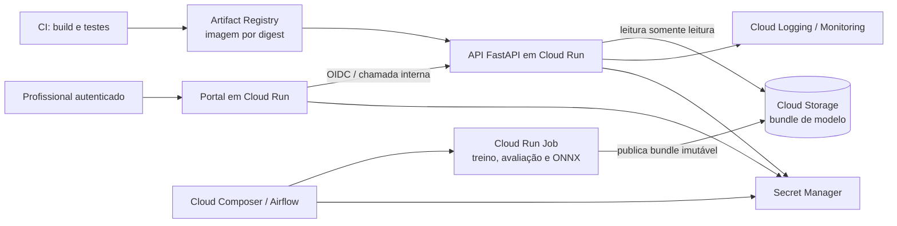

# ADR 0004 — Arquitetura GCP para inferência real-time e retreino batch

- **Status:** Proposta — aguarda revisão arquitetural de Fábio antes do merge
- **Data:** 2026-09-12
- **Responsável:** Romário
- **Decisores:** Romário (proposta), Fábio (revisão de arquitetura), Denis e Bill (revisão dos consumidores)

## Contexto

O projeto já possui uma imagem Docker endurecida da API FastAPI, portal Streamlit,
artefatos de modelo versionados e validados, duas variantes de inferência
(`sklearn` e `onnx`), uma DAG Airflow idempotente e uma stack local de
Prometheus/Grafana. Os artefatos seguem o padrão imutável
`YYYYMMDDTHHMMSSZ-<input_hash>` e cada bundle contém modelo, manifesto,
classes, checksums e evidências de treino.

O caminho online deve responder a uma predição de forma **real-time**. Já
ingestão, preparação, treino, avaliação, export ONNX e promoção de artefato são
atividades **batch**: não podem estar no caminho de uma requisição clínica.

Há ainda restrições relevantes:

- o texto clínico é sensível e é descartado após a resposta; não pode ir para
  logs, métricas ou mensagens de erro;
- o RBAC estático atual é uma proteção de entrega local, e o login Streamlit
  local não é identidade de produção;
- `POST /reload` troca apenas o holder em memória de um processo. Em um serviço
  com várias instâncias, ele não é mecanismo consistente de rollout;
- não existe infraestrutura GCP provisionada neste repositório. Esta ADR define
  o alvo de deploy; não afirma que ele já foi realizado.

## Opções avaliadas

| Decisão | Opção escolhida | Alternativas consideradas | Motivo |
|---|---|---|---|
| Serviço de inferência | Cloud Run | GKE Autopilot; Compute Engine | A API já é um container HTTP stateless e a carga é variável. Cloud Run elimina a operação de cluster/VM e permite escalar por requisições. GKE só se justifica com workloads longos, vários serviços stateful ou controle de rede que o projeto não demonstrou. Compute Engine adicionaria patching e capacidade ociosa. |
| Registro de imagens | Artifact Registry | Docker Hub/GHCR; imagem local | Mantém imagens privadas, IAM por repositório e integração direta ao deploy. Tags de conveniência não são a identidade da versão: a promoção usa digest imutável. |
| Registro de artefatos | Cloud Storage | Incluir o modelo na imagem; Filestore | Os bundles do modelo já são versionados, são binários e têm ciclo de vida distinto do código. Cloud Storage preserva essa separação. Incluir o modelo na imagem duplica builds para cada retreino; Filestore é inadequado para este acesso somente leitura e adiciona operação. |
| Orquestração batch | Cloud Composer (Airflow) + Cloud Run Job para trabalho pesado | Airflow em VM; Cloud Scheduler sozinho | A DAG existente já expressa dependências, idempotência e evidências. Composer preserva Airflow como orquestrador; o Job executa treino/export sem manter um servidor de inferência ativo. Para uma prova de conceito de baixo custo, o Airflow Docker local permanece suficiente até haver cadência real de retreino. |
| Identidade humana | IdP/OIDC corporativo ou Identity Platform | Usuário/senha Streamlit; API key no navegador | Claims assinadas permitem representar `doctor` e `patient` sem confiar em papel enviado por body/header. As credenciais locais atuais não devem ser promovidas. |

## Decisão proposta

Adotar **GCP** com Cloud Run, Artifact Registry, Cloud Storage, Secret Manager,
Cloud Logging/Monitoring e Cloud Composer quando o retreino recorrente justificar
seu custo. A região final deve ser uma região que suporte todos os serviços
escolhidos e esteja próxima dos usuários; a disponibilidade e o preço devem ser
confirmados na conta GCP antes do provisionamento. Não há compromisso com uma
região específica nesta ADR.

### Inferência e promoção

1. O CI gera a imagem já existente, executa seus checks e publica-a no Artifact
   Registry. O deploy referencia o **digest**, não uma tag mutável.
2. Cada modelo publicado pela DAG vai para um prefixo imutável, por exemplo
   `gs://<bucket-modelos>/models/<model_version>/`. O bundle inclui
   `model.joblib`, `model.onnx` quando disponível, `metadata.json`,
   `classes.json`, checksums e evidências. O bucket não é público.
3. A revisão Cloud Run recebe `MODEL_PATH` apontando para o bundle escolhido em
   um volume Cloud Storage montado como somente leitura. A aplicação mantém a
   validação atual de manifesto e checksum antes de desserializar.
4. Promover um modelo significa criar uma **nova revisão** com `MODEL_VERSION`
   e `MODEL_VARIANT` declarados, executar smoke tests e deslocar tráfego para
   ela. Rollback é voltar o tráfego para a revisão/digest anterior. `/reload`
   continua útil em desenvolvimento ou numa única instância administrativa,
   mas não é a estratégia de deploy multi-instância.

O volume Cloud Storage usa Cloud Storage FUSE. Ele é compatível com a leitura
dos arquivos atuais, mas adiciona dependência de rede e pode afetar cold start;
o tamanho de memória, o tempo de startup e a leitura do `joblib` devem ser
medidos em uma prova de carga antes da promoção. Se o resultado não atender ao
SLO, a alternativa é baixar e validar o bundle no diretório efêmero no startup
ou publicar uma imagem por modelo — decisões que exigem nova avaliação de
reprodutibilidade e tempo de build.

### Batch e Airflow

Cloud Composer hospeda as DAGs existentes e coordena ingestão, validação,
treino, avaliação, export ONNX, benchmark e publicação. O treinamento em si
deve rodar em Cloud Run Job, com uma service account distinta, e não no serviço
web de inferência. A DAG só promove um prefixo após validar os artefatos e
registrar métricas; reexecuções com o mesmo fingerprint continuam idempotentes.

Uma rotina de CI ou um operador do Airflow dispara uma nova revisão Cloud Run
após o gate de promoção. O serviço de inferência não recebe permissão para
escrever no bucket; ele apenas lê a versão já aprovada.

### Segurança e privacidade

- Cada Cloud Run service/job usa service account própria e privilégio mínimo.
  A API recebe apenas leitura do prefixo de modelos e acesso aos segredos que
  realmente consome; o Job de treino recebe escrita no bucket; o CI recebe
  escrita somente no repositório Artifact Registry.
- Segredos ficam no Secret Manager, com acesso pela service identity. Nenhuma
  chave de API, senha do portal ou token DagsHub entra em imagem, Git ou
  argumento de deploy.
- O portal público só deve ser exposto após integrar IdP/OIDC e validar issuer,
  audience, expiração e claims no backend. A claim `doctor` permite a predição;
  a claim `patient` não recebe resultado, score, label ou texto. A chave
  estática atual fica restrita a compatibilidade interna durante a migração.
- A API fica com ingress restrito ao portal/balanceador e aos chamadores de
  serviço autorizados. `/metrics`, `/models`, `/model-info` e `/reload` não
  devem ser expostos publicamente. Cloud Logging recebe somente os logs JSON
  já sanitizados; a política de não reter `text` permanece obrigatória.

### Disponibilidade, escala e custo

- Cloud Run escala horizontalmente por requisições e concorrência. A
  concorrência, CPU/memória e máximo de instâncias devem ser ajustados com o
  benchmark da variante ONNX e métricas de produção; não se assume que o
  baseline local representa o p95 em nuvem.
- `min-instances=0` reduz custo em demonstração/baixo tráfego, mas pode causar
  cold start. Para uma triagem com SLO de resposta, começar com
  `min-instances=1`, medir e ajustar. Alta disponibilidade exige múltiplas
  instâncias mínimas e também orçamento/quota adequados.
- Cloud Storage usa bucket regional co-localizado, controle IAM, soft delete e
  regras de lifecycle para reter versões aprovadas e expirar versões de
  experimento. Object Versioning não substitui o versionamento imutável do
  projeto: os dois controles se complementam.
- O principal custo recorrente tende a ser Cloud Composer, não o serviço
  serverless de baixa demanda. Por isso Composer é ativado apenas para
  retreino operacional; no estágio acadêmico, a execução Docker da DAG é a
  alternativa econômica e reproduzível.

### Observabilidade

Cloud Logging e Cloud Monitoring cobrem logs, disponibilidade e métricas de
plataforma do Cloud Run. Prometheus/Grafana do repositório continuam como stack
local de comparação entre variantes. Antes de publicar métricas da aplicação em
cloud, deve ser definido um caminho autenticado para Managed Service for
Prometheus/OpenTelemetry; não se deve abrir `GET /metrics` na internet apenas
para permitir scrape.

## Consequências

**Positivas**

- separa código (imagem), artefato (Cloud Storage) e execução online (Cloud
  Run), preservando os contratos atuais;
- permite rollout/rollback por revisão e digest, em vez de alterar memória de
  instâncias diferentes;
- mantém Airflow no papel correto de batch e evita treino no caminho clínico;
- oferece uma trilha explícita para sair do login demonstrativo e das chaves
  estáticas sem enfraquecer a proteção ao paciente.

**Trade-offs e pendências antes de produção**

- a migração para OIDC/claims, a política de ingress e o bloqueio/controle de
  endpoints operacionais ainda exigem implementação e testes;
- Cloud Storage FUSE precisa ser testado sob cold start e carga;
- Composer eleva custo e complexidade; deve ter orçamento, alertas e uma
  cadência de retreino justificada;
- esta ADR não provisiona recursos, não publica dados e não comprova SLO em
  cloud. Esses fatos só podem ser declarados após um deploy controlado.

## Critérios de aceite para a futura implementação

1. Imagem é publicada por digest no Artifact Registry após CI verde.
2. Apenas bundles íntegros e aprovados são legíveis pela API; a revisão registra
   explicitamente versão e variante.
3. Testes de rollout e rollback confirmam que duas instâncias não ficam com
   versões divergentes.
4. Testes de autorização confirmam que um paciente não obtém resultado clínico
   nem por chamada direta à API.
5. Logs, métricas e alertas passam por teste de privacidade com canário de
   texto, sem exposição de payload ou segredo.
6. Carga em nuvem mede p50/p95/p99, cold start e custo estimado antes de definir
   SLO e `min-instances`.

## Referências oficiais

- [Cloud Run: identidade de serviço](https://docs.cloud.google.com/run/docs/configuring/services/service-identity)
- [Cloud Run: segredos via Secret Manager](https://docs.cloud.google.com/run/docs/configuring/services/secrets)
- [Cloud Run: concorrência e autoscaling](https://docs.cloud.google.com/run/docs/about-concurrency)
- [Cloud Run: volume Cloud Storage e limitações do FUSE](https://docs.cloud.google.com/run/docs/configuring/services/cloud-storage-volume-mounts)
- [Artifact Registry: imagens Docker e IAM](https://docs.cloud.google.com/artifact-registry/docs/docker)
- [Cloud Storage: versionamento de objetos](https://docs.cloud.google.com/storage/docs/object-versioning)
- [Cloud Composer: execução de DAGs Airflow](https://docs.cloud.google.com/composer/docs/run-apache-airflow-dag)
- [Identity Platform: custom claims para papéis](https://docs.cloud.google.com/identity-platform/docs/how-to-configure-custom-claims)
